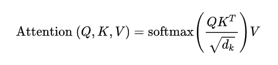

# transformer入门篇一
## 一、背景
Transformer是201年的一篇《Attention is All You Need》提出的一种模型架构，针对机器翻译这一场景做了实验。现阶段，transformer在cv领域也是全面开花。
## 二、概念介绍
### 1. self-attention
自注意力机制：举例理解，一句话中每个词看其他词与自己的关系，这个词和其他句子中的词的关系叫做注意力机制。

- 怎么计算
```
每个词向量都有Q、K、V三个辅助向量，通过训练得到：

Q：query，要去查询的（词X主动查别的词向量和自己关系时，要用到的向量）  
K：key，等着被查的（当词X被别的词向量查询时，需要出示的向量）  
V：value，实际的特征信息（当前词X的特征向量）  

整体计算流程：
（比如一个词向量X要和三个词向量计算attention，q1k1,q2k2,q3k3，之后归一化，q1k1/(q1k1+q2k2+q3k3)，逐个归一化得到权重w1,w2,w3。则Attention Value z(X) = w1*v1 + w2*v2 + w3*v3.

【1】每个词的Q和每个K计算得分；
【2】除以根号dk，消除维数不同对相似程度的影响；（比如向量64维度，开根号变成8）
【2】Softmax后得到整个加权结果；
【3】Softmax * Value得到最终结果。
```


### 2. multi-head机制

### 3. transformer在CV方向的应用

## 参考链接
https://blog.csdn.net/weixin_51449137/article/details/119320574
