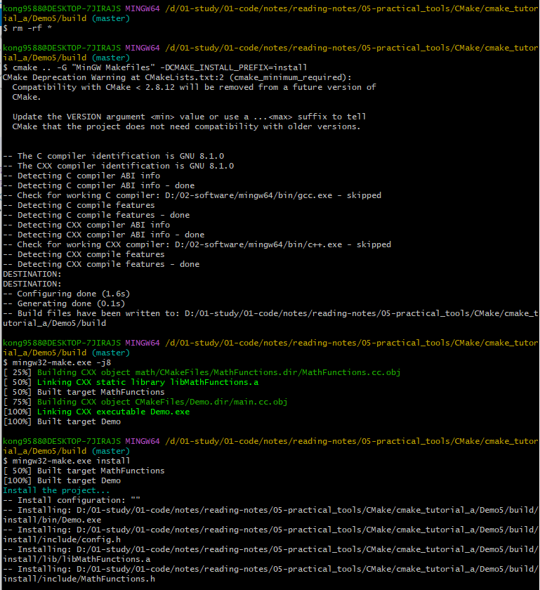
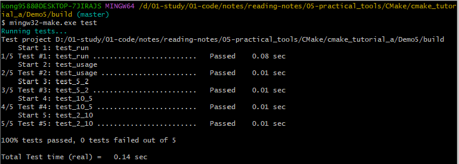

# CMake
## 一、cmake_tutorial_a
原文链接：
- [全网最细的CMake教程！(强烈建议收藏)](https://zhuanlan.zhihu.com/p/534439206)  
- [Code](https://github.com/wzpan/cmake-demo)

### 1. 什么是CMake？
- "Write once, run everywhere"
- <mark>允许开发者编写一种平台无关的 CMakeList.txt 文件来定制整个编译流程，然后再根据目标用户的平台进一步生成所需的本地化 Makefile 和工程文件；</mark>
- 解决多种Make工具（GNU Make、QT的qmake，微软的MS nmake，BSD的Make(pmake)、Makepp等）无法跨平台编译的问题。
- CMake 是一个比上述几种 make 更高级的编译配置工具。在Linux平台使用CMake生成Makefile并编译的流程：  
  （1）写 CMake 配置文件 CMakeLists.txt；  
  （2）执行命令 cmake PATH 或者 ccmake PATH 生成 Makefile（ccmake 和 cmake 的区别在于前者提供了一个交互式的界面）。其中， PATH 是 CMakeLists.txt 所在的目录；  
  （3）使用 make 命令进行编译。


### 2. 入门案例：单个源文件
- 文件目录树  
  ```
  ./Demo1
    |
    +--- main.cc
  ```
- 编写CMakeLists.txt
  ```
  # CMake 最低版本号要求
  cmake_minimum_required (VERSION 2.8)
  # 项目信息
  project (Demo1)
  # 指定生成目标
  add_executable(Demo main.cc)
  ```
- 生成MakeFile、编译、执行
    ```
    cmake .. -G "MinGW Makefiles" # 生成MakeFile(win10环境)
    mingw32-make.exe -j8 # 编译
    ./CMake_Demo.exe 5 3 # 执行
    ```

### 3. 多个源文件
#### 3.1 同一目录，多个源文件
- 文件目录树
  ```
  ./Demo2
    |
    +--- main.cc
    |
    +--- MathFunctions.cc
    |
    +--- MathFunctions.h
  ```
- 编写CMakeLists.txt
  ```
  # CMake 最低版本号要求\
  cmake_minimum_required (VERSION 2.8)
  # 项目信息
  project (Demo2)
  # 查找当前目录下的所有源文件，并将名称保存到 DIR_SRCS 变量
  aux_source_directory(. DIR_SRCS)
  # 指定生成目标
  add_executable(Demo ${DIR_SRCS})
  ```
  <mark>查找指定目录下的所有源文件，然后将结果存进指定变量名：`aux_source_directory(<dir> <variable>)`</mark>
#### 3.2 多个目录，多个源文件、
- 文件目录树
  ```
  ./Demo3
    |
    +--- main.cc
    |
    +--- math/
          |
          +--- MathFunctions.cc
          |
          +--- MathFunctions.h
  ```
- 编写CMakeLists.txt  
  <mark>项目根目录 Demo3 和 math 目录里各编写一个 CMakeLists.txt 文件，先将 math 目录里的文件编译成静态库再由 main 函数调用</mark>  


  （1）根目录下
    - 使用命令 add_subdirectory 指明本项目包含一个子目录 math，这样 math 目录下的 CMakeLists.txt 文件和源代码也会被处理
  ```
  # CMake 最低版本号要求
  cmake_minimum_required (VERSION 2.8)
  # 项目信息
  project (Demo3)

  # 查找当前目录下的所有源文件，并将名称保存到 DIR_SRCS 变量
  aux_source_directory(. DIR_SRCS)

  # 添加 math 子目录
  add_subdirectory(math)

  # 指定生成目标 
  add_executable(Demo main.cc)

  # 添加链接库
  target_link_libraries(Demo MathFunctions)
  ```
  （2）math目录下
  - <mark>使用命令 add_library 将 src 目录中的源文件编译为静态链接库。</mark>
  ```
  # 查找当前目录下的所有源文件，并将名称保存到 DIR_LIB_SRCS 变量
  aux_source_directory(. DIR_LIB_SRCS)
  
  # 生成链接库
  add_library (MathFunctions ${DIR_LIB_SRCS})
  ```
### 4. 自定义编译选项
CMake 允许为项目增加编译选项，从而可以根据用户的环境和需求选择最合适的编译方案。
#### 4.1 修改CMakeLists文件
  ```
  cmake_minimum_required (VERSION 2.8)
  project (Demo4)

  # 加入一个配置头文件，用于处理 CMake 对源码的设置
  configure_file (
    "${PROJECT_SOURCE_DIR}/config.h.in"
    "${PROJECT_BINARY_DIR}/config.h"
  )

  # 是否使用自己的 MathFunctions 库
  option (USE_MYMATH
         "Use provided math implementation" ON)

  # 是否加入 MathFunctions 库
  if (USE_MYMATH)
    include_directories ("${PROJECT_SOURCE_DIR}/math")
    add_subdirectory (math)  
    set (EXTRA_LIBS ${EXTRA_LIBS} MathFunctions)
  endif (USE_MYMATH)

  aux_source_directory(. DIR_SRCS)
  add_executable(Demo ${DIR_SRCS})
  target_link_libraries (Demo  ${EXTRA_LIBS})
  ```
  （1）<mark>configure_file 命令用于加入一个配置头文件 config.h，这个文件由 CMake 从 config.h.in 生成</mark>，通过这样的机制，将可以<mark>通过预定义一些参数和变量来控制代码的生成</mark>；  
  （2）<mark>option 命令添加了一个 USE_MYMATH 选项</mark>，并且默认值为 ON；  
  （3）<mark>根据 USE_MYMATH 变量的值来决定是否使用我们自己编写的 MathFunctions 库</mark>。
#### 4.2 修改main.cc文件
引用config.h，让其根据 USE_MYMATH 的预定义值来决定是否调用标准库还是 MathFunctions 库
  ```
  #include "config.h"

  #ifdef USE_MYMATH
    #include "math/MathFunctions.h"
  #else
    #include <math.h>
  #endif

  ...

  #ifdef USE_MYMATH
    printf("Now we use our own Math library. \n");
    double result = power(base, exponent);
  #else
    printf("Now we use the standard library. \n");
    double result = pow(base, exponent);
  #endif
    printf("%g ^ %d is %g\n", base, exponent, result);
    return 0;
  ```
#### 4.3 编写config.h文件
  CMakeLists中通过configure_file引用了一个config.h文件，这个文件预定义了`USE_MYMATH`的值。`但我们并不直接编写这个文件`，为了方便从 CMakeLists.txt 中导入配置，我们编写一个 config.h.in 文件，内容如下：
  ```
  #cmakedefine USEU_MYMATH
  ```
  **CMake 会自动根据 CMakeLists 配置文件中的设置自动生成 config.h 文件。**
#### 4.4 USE_MYMATH配置测试
（1）USE_MYMATH 为 ON  ---> config.h 的内容为`#define USE_MYMATH`  
（2）USE_MYMATH 为 OFF ---> config.h 的内容为`/* #undef USE_MYMATH */`

### 5. 安装和测试
CMake 也可以指定安装规则，以及添加测试。这两个功能分别可以通过在产生 Makefile 后使用 `make install` 和 `make test` 来执行
#### 5.1 定制安装规则
- 生成Makefile时，通过`DCMAKE_INSTALL_PREFIX`指定install的路径，否则会用默认路径/usr/local/？
  ```
  cmake .. -G "MinGW Makefiles" -DCMAKE_INSTALL_PREFIX=install
  ```
- 先在 math/CMakeLists.txt 文件里添加下面两行，指明 MathFunctions 库的安装路径
  ```
  # 指定 MathFunctions 库的安装路径
  install (TARGETS MathFunctions DESTINATION lib)
  install (FILES MathFunctions.h DESTINATION include)
  ```
- 之后同样修改根目录的 CMakeLists 文件，在末尾添加下面几行：
  ```
  # 指定安装路径
  install (TARGETS Demo DESTINATION bin)
  install (FILES "${PROJECT_BINARY_DIR}/config.h"
          DESTINATION include)
  ```
示例：


#### 5.2 为工程添加测试
- 添加测试同样很简单。CMake 提供了一个称为 CTest 的测试工具。我们要做的只是在项目根目录的 CMakeLists 文件中调用一系列的 `add_test` 命令。
  ```
  # 启用测试
  enable_testing()

  # 测试程序是否成功运行
  add_test (test_run Demo 5 2)

  # 测试帮助信息是否可以正常提示
  add_test (test_usage Demo)
  set_tests_properties (test_usage
    PROPERTIES PASS_REGULAR_EXPRESSION "Usage: .* base exponent")

  # 测试 5 的平方
  add_test (test_5_2 Demo 5 2)

  set_tests_properties (test_5_2
  PROPERTIES PASS_REGULAR_EXPRESSION "is 25")

  # 测试 10 的 5 次方
  add_test (test_10_5 Demo 10 5)

  set_tests_properties (test_10_5
  PROPERTIES PASS_REGULAR_EXPRESSION "is 100000")

  # 测试 2 的 10 次方
  add_test (test_2_10 Demo 2 10)

  set_tests_properties (test_2_10
  PROPERTIES PASS_REGULAR_EXPRESSION "is 1024")
  ```
- 如果要测试更多的输入数据，像上面那样一个个写测试用例未免太繁琐。这时可以通过编写宏来实现
  ```
  # 定义一个宏，用来简化测试工作
  macro (do_test arg1 arg2 result)
    add_test (test_${arg1}_${arg2} Demo ${arg1} ${arg2})
    set_tests_properties (test_${arg1}_${arg2}
      PROPERTIES PASS_REGULAR_EXPRESSION ${result})
  endmacro (do_test)

  # 利用 do_test 宏，测试一系列数据
  do_test (5 2 "is 25")
  do_test (10 5 "is 100000")
  do_test (2 10 "is 1024")
  ```
示例：


### 6. 支持GDB
让 CMake 支持 gdb 的设置也很容易，只需要指定 Debug 模式下开启 -g 选项，之后可以直接对生成的程序使用 gdb 来调试。
```
set(CMAKE_BUILD_TYPE "Debug")
set(CMAKE_CXX_FLAGS_DEBUG "$ENV{CXXFLAGS} -O0 -Wall -g -ggdb")
set(CMAKE_CXX_FLAGS_RELEASE "$ENV{CXXFLAGS} -O3 -Wall")
```

### 7. 添加环境检查
有时候可能要对系统环境做点检查，例如要使用一个平台相关的特性的时候。在这个例子中，我们检查系统是否自带 pow 函数。如果带有 pow 函数，就使用它；否则使用我们定义的 power 函数。

#### 7.1 添加 CheckFunctionExists 宏
在顶层 CMakeLists 文件中添加 `CheckFunctionExists.cmake` 宏，并调用 check_function_exists 命令测试链接器是否能够在链接阶段找到 pow 函数
```
# 检查系统是否支持 pow 函数
include (${CMAKE_ROOT}/Modules/CheckFunctionExists.cmake)
check_function_exists (pow HAVE_POW)
```

#### 7.2 预定义相关宏变量
接下来修改 config.h.in 文件，预定义相关的宏变量。
```
// does the platform provide pow function?
#cmakedefine HAVE_POW
```

#### 7.3 在代码中使用宏和函数
修改main.cc，在代码中使用宏和函数
```
#ifdef HAVE_POW
  printf("Now we use the standard library. \n");
  double result = pow(base, exponent);
#else
  printf("Now we use our own Math library. \n");
  double result = power(base, exponent);
#endif
```

### 8. 添加版本号
给项目添加和维护版本号是一个好习惯，这样有利于用户了解每个版本的维护情况，并及时了解当前所用的版本是否过时，或是否可能出现不兼容的情况。首先修改顶层 CMakeLists 文件，在 project 命令之后加入如下两行，分别指定当前的项目的主版本号和副版本号：
```
set (Demo_VERSION_MAJOR 1)
set (Demo_VERSION_MINOR 0)
```
为了在代码中获取版本信息，我们可以修改 config.h.in 文件，添加两个预定义变量：
```
// the configured options and settings for Tutorial
#define Demo_VERSION_MAJOR @Demo_VERSION_MAJOR@
#define Demo_VERSION_MINOR @Demo_VERSION_MINOR@
```
可以在代码里面使用和打印：
```
#include <stdio.h>
#include <stdlib.h>
#include <math.h>
#include "config.h"
#include "math/MathFunctions.h"

int main(int argc, char *argv[])
{
    if (argc < 3){
        // print version info
        printf("%s Version %d.%d\n",
            argv[0],
            Demo_VERSION_MAJOR,
            Demo_VERSION_MINOR);
        printf("Usage: %s base exponent \n", argv[0]);
        return 1;
    }
}
```

### 9. 生成安装包
<mark>配置生成各种平台上的安装包，包括二进制安装包和源码安装包</mark>。为了完成这个任务，我们需要用到 `CPack` ，它同样也是由 CMake 提供的一个工具，专门用于打包。

windows系统打包过程需要用到NSIS
```
NSIS，全称 Nullsoft Scriptable Install System，中文叫做 Nullsoft 脚本安装系统。它是用于创建 Windows 安装程序的专业开源系统。它被设计为尽可能小且灵活，因此非常适合 Internet 分发。

它提供了安装、卸载、系统设置、文件解压缩等功能。NSIS 是基于脚本的，通过它的脚本语言来描述安装程序的行为和逻辑的。
```

- 修改顶层CMakeLists.txt：
   ```
   # 构建一个 CPack 安装包

   # 导入 InstallRequiredSystemLibraries 模块，以便之后导入 CPack 模块
   include (InstallRequiredSystemLibraries) 
   # 设置一些 CPack 相关变量，包括版权信息和版本信息，其中版本信息用了上一节定义的版本号
   set (CPACK_RESOURCE_FILE_LICENSE
     "${CMAKE_CURRENT_SOURCE_DIR}/License.txt")
   set (CPACK_PACKAGE_VERSION_MAJOR "${Demo_VERSION_MAJOR}")
   set (CPACK_PACKAGE_VERSION_MINOR "${Demo_VERSION_MINOR}")
   # 导入 CPack 模块
   include (CPack)
   ```
- 生成二进制安装包
   ```
   cpack -C CPackConfig.cmake
   ```
- 生成源码安装包
   ```
   cpack -C CPackSourceConfig.cmake
   ```

### 10. 项目迁移
CMake 可以很轻松地构建出在适合各个平台执行的工程环境。而如果当前的工程环境不是 CMake ，而是基于某个特定的平台，也可以迁移到 CMake。

常见的迁移场景：
```
autotools
qmake：make converter 可以转换使用 QT 的 qmake 的工程；
Visual Studio：vcproj2cmake.rb 可以根据 Visual Studio 的工程文件（后缀名是 .vcproj 或 .vcxproj）生成 CMakeLists.txt 文件等；
CMakeLists.txt 自动推导：gencmake 根据现有文件推导 CMakeLists.txt 文件等；
类似工具：SCons等。
```
