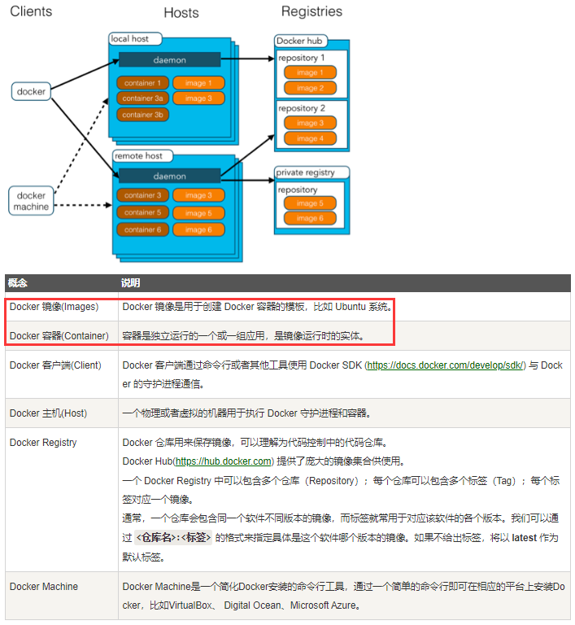
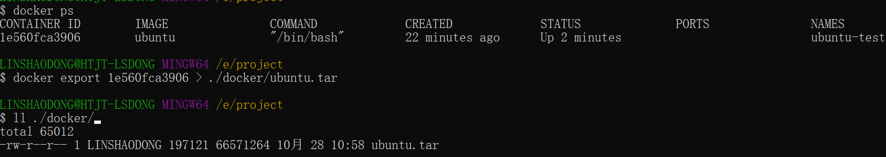
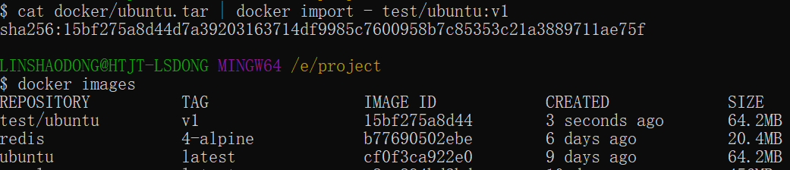

# Docker基础教程
## 一、简介  
Docker 是一个开源的应用容器引擎，基于 Go 语言 并遵从 Apache2.0 协议开源。

<mark>Docker 可以让开发者打包他们的应用以及依赖包到一个轻量级、可移植的容器中，然后发布到任何流行的 Linux 机器上，也可以实现虚拟化</mark>。

容器是完全使用沙箱机制，相互之间不会有任何接口（类似 iPhone 的 app）,更重要的是容器性能开销极低。
- Docker的应用场景  
（1）Web 应用的自动化打包和发布。  
（2）自动化测试和持续集成、发布。  
（3）在服务型环境中部署和调整数据库或其他的后台应用。  
（4）从头编译或者扩展现有的 OpenShift 或 Cloud Foundry 平台来搭建自己的 PaaS 环境。
- Docker的优点  
（1）快速，一致地交付您的应用程序
（2）响应式部署和扩展
（3）在同一硬件上运行更多工作负载

## 二、Docker架构
 Docker 包括三个基本概念:  
 <mark>
  （1）镜像（Image）：Docker 镜像（Image），就相当于是一个 root 文件系统。比如官方镜像 ubuntu:16.04 就包含了完整的一套 Ubuntu16.04 最小系统的 root 文件系统。  
  （2）容器（Container）：镜像（Image）和容器（Container）的关系，就像是面向对象程序设计中的类和实例一样，镜像是静态的定义，容器是镜像运行时的实体。容器可以被创建、启动、停止、删除、暂停等。</mark>   
  （3）仓库（Repository）：仓库可看成一个代码控制中心，用来保存镜像。  
 

- Docker 使用客户端-服务器 (C/S) 架构模式，使用远程API来管理和创建Docker容器。
- Docker 容器通过 Docker 镜像来创建。  
- <mark>容器与镜像的关系类似于面向对象编程中的对象与类</mark>。  
镜像：类；容器：对象



## 三、Docker安装
CentOS使用官方安装脚本自动安装
```
curl -fsSL https://get.docker.com | bash -s docker --mirror Aliyun
```
卸载docker
```
yum remove docker-ce # 删除安装包
rm -rf /var/lib/docker # 删除镜像、容器、配置文件等内容
```

## 四、Docker使用
### 1. Docker Hello World
Docker 允许你在容器内运行应用程序， 使用 docker run 命令来在容器内运行一个应用程序。
```
runoob@runoob:~$ docker run ubuntu:15.10 /bin/echo "Hello world"
Hello world

各个参数解析：
docker: Docker 的二进制执行文件。

run: 与前面的 docker 组合来运行一个容器。

ubuntu:15.10 指定要运行的镜像，Docker 首先从本地主机上查找镜像是否存在，如果不存在，Docker 就会从镜像仓库 Docker Hub 下载公共镜像。

/bin/echo "Hello world": 在启动的容器里执行的命令
```
以上命令完整的意思可以解释为：Docker 以 ubuntu15.10 镜像创建一个新容器，然后在容器里执行 bin/echo "Hello world"，然后输出结果。

- 运行交互式的容器  
<mark>通过 docker 的两个参数 -i -t，让 docker 运行的容器实现"对话"的能力</mark>：
```
runoob@runoob:~$ docker run -i -t ubuntu:15.10 /bin/bash
root@0123ce188bd8:/#

各个参数解析：
-t: 在新容器内指定一个伪终端或终端。
-i: 允许你对容器内的标准输入 (STDIN) 进行交互。

可以通过运行 exit 命令或者使用 CTRL+D 来退出容器。
```
- 启动容器（后台模式）  
<mark>使用以下命令创建一个以进程方式运行的容器 docker run -d ...</mark>
```
runoob@runoob:~$ docker run -d ubuntu:15.10 /bin/sh -c "while true; do echo hello world; sleep 1; done"
2b1b7a428627c51ab8810d541d759f072b4fc75487eed05812646b8534a2fe63

# 2b1b7a.. 长字符串叫做容器 ID
```


- <mark>常用命令</mark>
```
docker ps # 查看在运行的容器

docker run -itd [image] [command] # 后台运行交互式容器

docker logs container_id # 查看容器内的标准输出

docker stop container_id # 停止容器
```


```
runoob@runoob:~$ docker ps
CONTAINER ID        IMAGE                  COMMAND              ...  
5917eac21c36        ubuntu:15.10           "/bin/sh -c 'while t…"    ...

输出详情介绍：
CONTAINER ID: 容器 ID。
IMAGE: 使用的镜像。
COMMAND: 启动容器时运行的命令。
CREATED: 容器的创建时间。
STATUS: 容器状态。
PORTS: 容器的端口信息和使用的连接类型（tcp\udp）。
NAMES: 自动分配的容器名称。
```

### 2. Docker容器使用
#### 2.1 Docker客户端  
可以通过命令 docker command --help 更深入的了解指定的 Docker 命令使用方法。  
例如我们要查看 docker stats 指令的具体使用方法：
```
runoob@runoob:~# docker stats --help
```
#### 2.2 容器使用
- <mark>常用命令</mark>
```
（1）获取镜像
docker pull ubuntu # 如果我们本地没有 ubuntu 镜像，我们可以使用 docker pull 命令来载入 ubuntu 镜像

（2）启动容器
docker run -it ubuntu /bin/bash # 启动容器（使用 ubuntu 镜像启动一个容器，参数为以命令行模式进入该容器）
参数说明：/bin/bash：放在镜像名后的是命令，这里我们希望有个交互式 Shell，因此用的是 /bin/bash。

docker run -itd --name ubuntu-test ubuntu /bin/bash # -d后台运行，注：加了 -d 参数默认不会进入容器，想要进入容器需要使用指令 docker exec

docker ps -a # 查看所有容器命令（包含已停止运行的）
docker start <容器 id> # 启动一个已停止的容器

（3）停止容器
docker stop <容器 id> # 停止容器
docker restart <容器 id> # 重启一个停止的容器

（4）进入容器
在使用 -d 参数时，容器启动后会进入后台。此时想要进入容器，可以通过以下指令进入：

docker attach # 如果从这个容器退出，会导致容器的停止。
docker exec # 推荐大家使用 docker exec 命令，因为此命令会退出容器终端，但不会导致容器的停止。

（5）导入和导出容器
docker export 1e560fca3906 > ubuntu.tar # 导出容器 1e560fca3906 快照到本地文件 ubuntu.tar

cat docker/ubuntu.tar | docker import - test/ubuntu:v1 # 将快照文件 ubuntu.tar 导入到镜像 test/ubuntu:v1（使用 docker import 从容器快照文件中再导入为镜像）

$ docker import http://example.com/exampleimage.tgz example/imagerepo # 通过指定 URL 或者某个目录来导入

（6）删除容器
docker rm -f <容器 id>

（7）端口的快捷方式
docker port # 查看容器端口的映射情况
```
导出容器

导入容器


### 3. Docker镜像使用
当运行容器时，使用的镜像如果在本地中不存在，docker 就会自动从 docker 镜像仓库中下载，默认是从 Docker Hub 公共镜像源下载。
```
runoob@runoob:~$ docker images           
REPOSITORY          TAG                 IMAGE ID            CREATED             SIZE
ubuntu              14.04               90d5884b1ee0        5 days ago          188 MB
php                 5.6                 f40e9e0f10c8        9 days ago          444.8 MB
nginx               latest              6f8d099c3adc        12 days ago         182.7 MB
mysql               5.6                 f2e8d6c772c0        3 weeks ago         324.6 MB
httpd               latest              02ef73cf1bc0        3 weeks ago         194.4 MB
ubuntu              15.10               4e3b13c8a266        4 weeks ago         136.3 MB
hello-world         latest              690ed74de00f        6 months ago        960 B
training/webapp     latest              6fae60ef3446        11 months ago       348.8 MB
```
```
各个选项说明:

REPOSITORY：表示镜像的仓库源
TAG：镜像的标签
IMAGE ID：镜像ID
CREATED：镜像创建时间
SIZE：镜像大小

同一仓库源可以有多个 TAG，代表这个仓库源的不同个版本，如 ubuntu 仓库源里，有 15.10、14.04 等多个不同的版本，我们使用 REPOSITORY:TAG 来定义不同的镜像。

docker run -t -i ubuntu:15.10 /bin/bash # 使用版本为15.10的ubuntu系统镜像来运行容器
注：若不指定版本标签，则默认使用ubuntu:latest镜像
```

- <mark>常用命令</mark>
```
（1）列出镜像列表
docker images # 列出本地主机上的镜像

（2）获取一个新镜像
docker pull ubuntu:13.10 # 获取一个新的镜像
（当我们在本地主机上使用一个不存在的镜像时 Docker 就会自动下载这个镜像。如果我们想预先下载这个镜像，我们可以使用 docker pull 命令来下载它）

（3）查找镜像
docker search httpd # 查找搜索httpd镜像
# 参数说明：
NAME: 镜像仓库源的名称
DESCRIPTION: 镜像的描述
OFFICIAL: 是否 docker 官方发布
stars: 类似 Github 里面的 star，表示点赞、喜欢的意思。
AUTOMATED: 自动构建。

（4）删除镜像
docker rmi hello-world # 删除 hello-world 镜像

（5）创建镜像
docker commit ...
docker build ...
```
- 创建镜像  
当我们从 docker 镜像仓库中下载的镜像不能满足我们的需求时，我们可以通过以下两种方式对镜像进行更改。  
  - 方式1、从已经创建的容器中更新镜像，并且提交这个镜像  
  使用镜像创建一个容器 -> 在运行容器内使用apt-get update命令进行更新 -> 退出容器 -> 执行docker commit命令来提交容器副本(ID 为 e218edb10161 的容器，是按我们的需求更改的容器)
  ```
  runoob@runoob:~$ docker commit -m="has update" -a="runoob" e218edb10161 runoob/ubuntu:v2
  sha256:70bf1840fd7c0d2d8ef0a42a817eb29f854c1af8f7c59fc03ac7bdee9545aff8

  参数说明：
  -m: 提交的描述信息
  -a: 指定镜像作者
  e218edb10161：容器 ID
  runoob/ubuntu:v2: 指定要创建的目标镜像名
  ```
  - 方式2、使用 Dockerfile 指令来创建一个新的镜像
  创建一个Dockerfile文件 -> 使用Dockerfile文件，通过docker build命令来从零构建镜像

---
## 参考链接
[1] https://www.runoob.com/docker/docker-tutorial.html