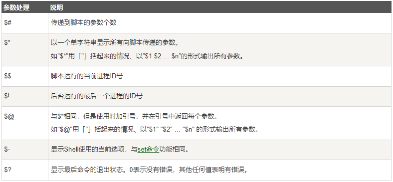
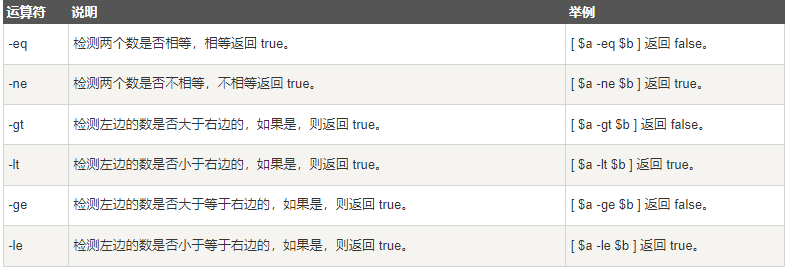
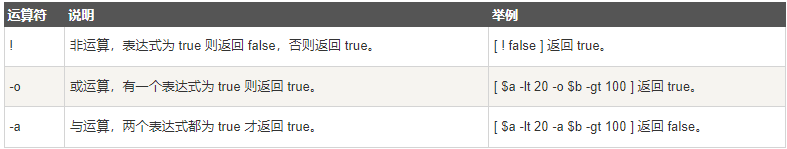
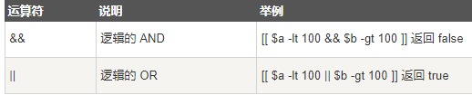
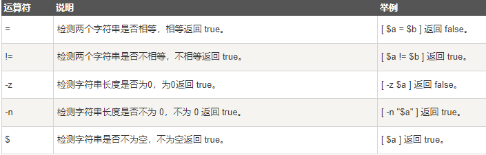
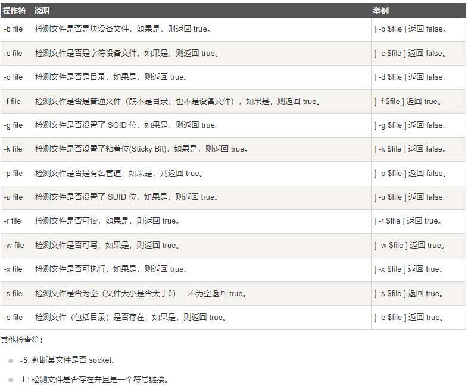
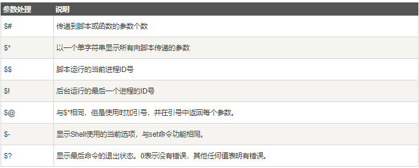
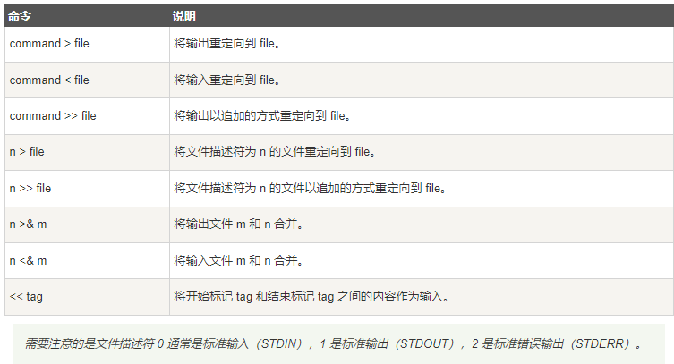

# Shell教程
参考链接：https://www.runoob.com/linux/linux-shell.html

## 一、简介
```
Shell 是一个用 C 语言编写的程序，它是用户使用 Linux 的桥梁。Shell 既是一种命令语言，又是一种程序设计语言。  
Shell 是指一种应用程序，这个应用程序提供了一个界面，用户通过这个界面访问操作系统内核的服务。
```
- Shell脚本  
Shell 脚本（shell script），是一种为 shell 编写的脚本程序。业界所说的 shell 通常都是指 shell 脚本。
- Shell环境  
Shell 编程跟 JavaScript、php 编程一样，只要有一个能编写代码的文本编辑器和一个能解释执行的脚本解释器就可以了。

  Linux 的 Shell 种类众多，常见的有：  
  

    <mark>本教程关注的是 Bash，也就是 Bourne Again Shell，由于易用和免费，Bash 在日常工作中被广泛使用。同时，Bash 也是大多数Linux 系统默认的 Shell。</mark>

    <mark>在一般情况下，人们并不区分 Bourne Shell 和 Bourne Again Shell，所以，像 #!/bin/sh，它同样也可以改为 #!/bin/bash。</mark>

    #! 告诉系统其后路径所指定的程序即是解释此脚本文件的 Shell 程序。
- 第一个shell脚本
    ```
    #!/bin/bash
    echo "Hello World !"
    ```
    #! 是一个约定的标记，它告诉系统这个脚本需要什么解释器来执行，即使用哪一种 Shell。
- 补充
   ```
    [1] sh(全称 Bourne Shell): 是UNIX最初使用的 shell，而且在每种 UNIX 上都可以使用。Bourne Shell 在 shell 编程方面相当优秀，但在处理与用户的交互方面做得不如其他几种 shell。

    [2] bash（全称 Bourne Again Shell）: LinuxOS 默认的，它是 Bourne Shell 的扩展。 与 Bourne Shell 完全兼容，并且在 Bourne Shell 的基础上增加了很多特性。可以提供命令补全，命令编辑和命令历史等功能。它还包含了很多 C Shell 和 Korn Shell 中的优点，有灵活和强大的编辑接口，同时又很友好的用户界面。

    [3] sh FileName 或 bash FileName可以不需要FileName有执行权限；./FileName要求有执行权限(chmod +x ..)
   ```

## 二、Shell变量
- 变量用法示例
  ```
  you_name="yll"
  echo ${you_name}    # 使用变量${var}

  readonly myUrl      # 只读变量 readonly
  myUrl="https://www.runoob.com"

  unset variable_name # 删除变量
  ```

## 三、Shell字符串  
- 字符串可以用单引号，也可以用双引号，也可以不用引号。
- 单引号字符串的限制：  
  （1）单引号里的任何字符都会原样输出，<mark>单引号字符串中的变量是无效的</mark>；  
  （2）单引号字串中不能出现单独一个的单引号（对单引号使用转义符后也不行），但可成对出现，作为字符串拼接使用。
- <mark>双引号的优势：  
  （1）双引号里可以有变量；  
  （2）双引号里可以出现转义字符。</mark>
  
- 字符串用法示例  
  拼接字符串
  ```
  your_name="runoob"
  # 使用双引号拼接
  greeting="hello, "$your_name" !"
  greeting_1="hello, ${your_name} !"
  echo $greeting  $greeting_1

  # 使用单引号拼接
  greeting_2='hello, '$your_name' !'
  greeting_3='hello, ${your_name} !'
  echo $greeting_2  $greeting_3

  # 输出结果：
  >> hello, runoob ! hello, runoob !
  >> hello, runoob ! hello, ${your_name} !
  ```

  获取字符串长度
  ```
  string="abcd"
  echo ${#string}       # 输出 4
  echo ${#string[0]}    # 输出 4，变量是字符串时${#string} 等价于 ${#string[0]}
  ```

  <mark>提取子字符串（留意#、##、%、%%的使用）</mark>
  ```
  string="runoob is a great site"
  echo ${string:1:4} # 输出 unoo

  >> 字符串截取补充内容：
    （1）#、## 表示从左边开始删除。一个 # 表示从左边删除到第一个指定的字符；两个 # 表示从左边删除到最后一个指定的字符。

    （2）%、%% 表示从右边开始删除。一个 % 表示从右边删除到第一个指定的字符；两个 % 表示从左边删除到最后一个指定的字符。
    删除包括了指定的字符本身。
  ```

  查找子字符串
  ```
  string="runoob is a great site"
  echo `expr index "$string" io`  # 输出 4（查找字符i或o的位置，哪个字母先出现就计算哪个）
  ```

  字符串替换
  ```
  > string="text, dummy, text, dummy"
  # 使用 string//pattern/string 进行全部 pattern 的替换
  > echo ${string//text/TEXT}
  TEXT, dummy, TEXT, dummy
  ```

## 四、Shell数组
- bash支持一维数组（不支持多维数组），并且没有限定数组的大小。下标从0开始，可以是整数或算术表达式，其值应大于或等于 0

- 简单示例
  ```
  # 定义数组
  array_name=(value0 value1 value2 value3)

  # 读取数组
  ${数组名[下标]}

  # 获取数组长度
  length=${#array_name[@]} 或 length=${#array_name[*]}

  # 获取数组单个元素的长度
  length=${#array_name[n]}

  # 获取数组中的所有元素（使用@ 或 *）
  echo "数组的元素为: ${array_name[*]}"
  echo "数组的元素为: ${array_name[@]}"

  # 遍历字符串
  echo "输入字符串（以空格分开）:"
  read str
  i=0
  for word in $str; do
      i=`expr $i + 1`
      eval a$i="$word"
      eval echo "数组的第 $i 个元素为: \$a$i"
  done
  ```

- 关联数组（类似于map）  
（1）Bash 支持关联数组，可以使用任意的字符串、或者整数作为下标来访问数组元素。  
（2）关联数组使用 declare 命令来声明，语法格式如下：  
`declare -A array_name`  
示例：
  ```
  declare -A site=(["google"]="www.google.com" ["runoob"]="www.runoob.com" ["taobao"]="www.taobao.com")

  echo ${site["runoob"]}
  # 输出结果：
  >> www.runoob.com

  # 在数组前加一个感叹号 ! 可以获取数组的所有键
  echo "数组的键为: ${!site[*]}"
  echo "数组的键为: ${!site[@]}"
  ```

## 五、Shell注释
- 单行注释：#
- 多行快捷注释：  
  方式一：（EOF也可以替换成COMMENT 或 ' 或 !）  
    ```
    :<<EOF
    注释内容...
    注释内容...
    注释内容...
    EOF
    ```
  方式二：使用格式 `: + 空格 + 单引号` （后面跟注释内容）

## 六、Shell传递参数
- <mark>我们可以在执行 Shell 脚本时，向脚本传递参数，脚本内获取参数的格式为：$n。n 代表一个数字，1 为执行脚本的第一个参数，2 为执行脚本的第二个参数，以此类推……</mark>

- 示例代码
  ```
  echo "执行的文件名：$0"
  echo "第一个参数为：$1, 第二个参数为：$2"
  echo "参数个数为：$#"
  echo "传递的参数作为一个字符串显示：$*" # 输入1 2 3，相当于传递了一个参数"1 2 3"
  echo "传递的参数作为一个字符串显示：$@" # 输入1 2 3，相当于传递了三个参数"1" "2" "3"

  # 执行脚本：./test.sh 1 2 3；以下为输出结果：
  >> 执行的文件名：./test.sh
  >> 第一个参数为：1，第二个参数为：2
  >> 参数个数为：3
  >> 传递的参数作为一个字符串显示：1 2 3
  ```

- 另外，还有几个特殊字符用来处理参数：
  

- <mark>含有空格的参数，在参数传递的时候加双引号</mark>
  ```
  my_procedure() {
    echo $1
    echo $2
    echo $3
  }
  my_procedure "$@" # 加双引号
  ```

## 七、Shell基本运算符
- Shell 和其他编程语言一样，支持多种运算符，包括：<mark>算数运算符、关系运算符、布尔运算符、字符串运算符、文件测试运算符</mark>
- <mark>原生bash不支持简单的数学运算，但是可以通过其他命令来实现，例如 awk 和 expr，expr 最常用</mark>。（expr 是一款表达式计算工具，使用它能完成表达式的求值操作）
  ```
  var=`expr 2 + 2`
  echo "两数之和为: $var"
  ```
- <mark>使用 [[ ... ]] 条件判断结构，而不是 [ ... ]，能够防止脚本中的许多逻辑错误</mark>。比如，&&、||、< 和 > 操作符。

- 算数运算符  
加减乘（\*）除、取余、赋值、相等/不相等

- 关系运算符  
关系运算符只支持数字，不支持字符串，除非字符串的值是数字  
下表列出了常用的关系运算符，假定变量 a 为 10，变量 b 为 20：


- 布尔运算符  
下表列出了常用的布尔运算符，假定变量 a 为 10，变量 b 为 20：  


- 逻辑运算符（注意双中括号）  
以下介绍 Shell 的逻辑运算符，假定变量 a 为 10，变量 b 为 20:  


- 字符串运算符  
下表列出了常用的字符串运算符，假定变量 a 为 "abc"，变量 b 为 "efg"：  


  > 注意下述示例：$a 这里应该加上双引号，否则 -n $a 的结果永远是 true
  ```
  a=""
  if [ -n "$a" ]
  then
    echo "-n $a : 字符串长度不为 0"
  else
    echo "-n $a : 字符串长度为 0"
  fi
  ```

- 文件测试运算符  
文件测试运算符用于检测 Unix 文件的各种属性


## 八、Shell echo命令
- 显示结果定向至文件
  ```
  echo "It is a test" > myfile
  ```

  ```
  > 重定向输出到某个位置，替换原有文件的所有内容。
  >> 重定向追加到某个位置，在原有文件的末尾添加内容。
  < 重定向输入某个位置文件。
  2> 重定向错误输出。
  2>> 重定向错误追加输出到文件末尾。
  &> 混合输出错误的和正确的都输出。
  ```

- 显示命令执行结果（反引号非单引号）
  ```
  echo `date`
  ```

## 九、Shell printf命令
- 输出命令 printf 命令模仿 C 程序库（library）里的 printf() 程序。
printf 由 POSIX 标准所定义，因此使用 printf 的脚本比使用 echo 移植性好
- printf 命令的语法（format-string：格式控制字符串，arguments: 参数列表）：  
`printf  format-string  [arguments...]`
  ```
  %s %c %d %f 都是格式替代符
  ％s 输出一个字符串
  ％d 整型输出
  ％c 输出一个字符
  ％f 输出实数，以小数形式输出。
  %-10s 指一个宽度为 10 个字符（- 表示左对齐，没有则表示右对齐）
  %-4.2f 指格式化为小数，其中 .2 指保留2位小数。
  ```

## 十、Shell test命令
- Shell中的 test 命令用于检查某个条件是否成立，它可以进行数值、字符和文件三个方面的测试。
- 数值测试、字符串测试、文件测试等  
示例：
  ```
  num1=100
  num2=200
  if test $[num1] -eq $[num2]
  then
      echo '两个数相等！'
  else
      echo '两个数不相等！'
  fi
  ```

## 十一、Shell流程控制
- if else-if else语法格式
  ```
  if condition1
  then
      command1
  elif condition2 
  then 
      command2
  else
      commandN
  fi
  ```

- for循环
  ```
  for var in item1 item2 ... itemN
  do
      command1
      command2
      ...
      commandN
  done
  ```

- while语句
  ```
  while condition
  do
      command
  done

  # 示例
  int=1
  while(( $int<=5 ))
  do
      echo $int
      let "int++"
  done
  ```

- until循环
  ```
  until condition
  do
      command
  done
  ```

- case ... esac（多分支选择结构，类似switch case）  
  （1）<mark>取值后面必须为单词 in，每一模式必须以右括号结束。取值可以为变量或常数，匹配发现取值符合某一模式后，其间所有命令开始执行直至 ;;</mark>
  （2）一旦匹配则不会执行其他的，若无匹配使用星号*捕获
  ```
  #!/bin/sh

  site="runoob"

  case "$site" in
    "runoob") echo "菜鸟教程"
    ;;
    "google") echo "Google 搜索"
    ;;
    "taobao") echo "淘宝网"
    ;;
  esac
  ```

## 十二、Shell函数
- shell中函数的定义格式如下：
  ```
  [ function ] funname [()]
  {
    action;
    [return int;]
  }
  ```
- 示例
  ```
  funWithReturn(){
    echo "这个函数会对输入的两个数字进行相加运算..."
    echo "输入第一个数字: "
    read aNum
    echo "输入第二个数字: "
    read anotherNum
    echo "两个数字分别为 $aNum 和 $anotherNum !"
    return $(($aNum+$anotherNum))
  } 
  funWithReturn
  echo "输入的两个数字之和为 $? !"
  ```
- <mark>函数返回值在调用该函数后通过 $? 来获得</mark>。（注意：<mark>需要及时获取，shell 语言中 0 代表 true，0 以外的值代表 false</mark>）
- 调用函数时可以向其传递参数。<mark>在函数体内部，通过 $n 的形式来获取参数的值</mark>。($10 不能获取第十个参数，需要写成${10})
- 处理参数的特殊字符说明：
  
  
## 十三、Shell输入/输出重定向
- 大多数 UNIX 系统命令从你的终端接受输入并将所产生的输出发送回​​到您的终端  
  重定向命令列表如下：
  
- 输出重定向（stdout）
  ```
  command1 > file1 # 将stdout重定向到file1
  ```
- 输入重定向（stdin）  
  这样，本来需要从键盘获取输入的命令会转移到文件读取内容。
  ```
  command1 < file1 # 将stdin重定向到file1

  # 执行command1，从文件infile读取内容，然后将输出写入到outfile中
  command1 < infile > outfile 
  ```
- 标准错误文件（stderr）
  ```
  $ command 2>file      # stderr 重定向到 file，向stderr流写入错误信息

  $ command > file 2>&1 # （stderr 重定向到 stdout）stdout 和 stderr 合并后重定向到 file
  ```
- /dev/null文件
  ```
  # 希望执行某个命令，但又不希望在屏幕上显示输出结果，可以将输出重定向到 /dev/null
  $ command > /dev/null

  # 屏蔽 stdout 和 stderr
  $ command > /dev/null 2>&1

  # 注意：0 是标准输入（STDIN），1 是标准输出（STDOUT），2 是标准错误输出（STDERR）。这里的 2 和 > 之间不可以有空格，2> 是一体的时候才表示错误输出
  ```

## 十四、Shell文件包含
- 和其他语言一样，Shell 也可以包含外部脚本。这样可以很方便的封装一些公用的代码作为一个独立的文件
- Shell 文件包含的语法格式如下：
  ```
  . filename   # 注意点号(.)和文件名中间有一空格  
  或
  source filename
  ```
- 示例：  
  （1）test.sh代码如下：
    ```
    #!/bin/bash
    # author:菜鸟教程
    # url:www.runoob.com

    url="http://www.runoob.com"
    ```
  （2）test2.sh代码如下：
    ```
    #!/bin/bash
    # author:菜鸟教程
    # url:www.runoob.com

    # 使用 . 号来引用test1.sh 文件
    . ./test1.sh

    # 或者使用以下包含文件代码
    # source ./test1.sh

    echo "菜鸟教程官网地址：$url"

    >> chomd +x test2.sh
    >> ./test2.sh
    >> 菜鸟教程官网地址：http://www.runoob.com # 执行结果
    ```


## 补充内容
- read 命令用于获取键盘输入信息  
    ```
    # 它的语法形式一般是：
    read [-options] [variable...]

    # 示例（-p 参数用于设置提示信息）
    read -p "input a val:" a    #获取键盘输入的 a 变量数字
    read -p "input b val:" b    #获取键盘输入的 b 变量数字
    r=$[a+b]                    #计算a+b的结果 赋值给r  不能有空格
    echo "result = ${r}"        #输出显示结果 r
    ```
- expr 命令使用
    ```
    # 表达式中的运算符左右必须包含空格，不包含空格将会输出表达式本身
    expr 5+6        // 直接输出 5+6
    expr 5 + 6      // 输出 11

    # 对于某些运算符，还需要我们使用符号"\"进行转义，否则就会提示语法错误
    expr 5 * 6       // 输出错误
    expr 5 \* 6      // 输出30
    ```
- 转移字符  
    转义字符是以反斜杠 \ 开头的字符，如\n；\t(制表符)；\"；\’；\\(反斜杆本身)  
    使用-e选项时，echo命令会解析字符串中的转义字符。
  ```
  echo -e "Hello\nWorld"

  # 输出结果
  >> Hello
  >> World
  ```
- 中括号（单中括号/双中括号）用于一些条件的测试  
  详见[Shell 中的中括号用法总结](https://www.runoob.com/w3cnote/shell-summary-brackets.html)
  ```
  [ $var -eq 0 ]      # 算数比较，判断一个变量是否为0
  [ -e $var ]         # 判断一个文件是否存在
  [ -d $var ]         # 判断一个目录是否存在
  [[ $var1 = $var2 ]] # 判断两个字符串是否相同
  ```
  