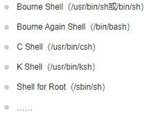

# Shell教程
参考链接：https://www.runoob.com/linux/linux-shell.html

## 一、简介
```
Shell 是一个用 C 语言编写的程序，它是用户使用 Linux 的桥梁。Shell 既是一种命令语言，又是一种程序设计语言。  
Shell 是指一种应用程序，这个应用程序提供了一个界面，用户通过这个界面访问操作系统内核的服务。
```
- Shell脚本  
Shell 脚本（shell script），是一种为 shell 编写的脚本程序。业界所说的 shell 通常都是指 shell 脚本。
- Shell环境  
Shell 编程跟 JavaScript、php 编程一样，只要有一个能编写代码的文本编辑器和一个能解释执行的脚本解释器就可以了。

  Linux 的 Shell 种类众多，常见的有：  
  

    <mark>本教程关注的是 Bash，也就是 Bourne Again Shell，由于易用和免费，Bash 在日常工作中被广泛使用。同时，Bash 也是大多数Linux 系统默认的 Shell。</mark>

    <mark>在一般情况下，人们并不区分 Bourne Shell 和 Bourne Again Shell，所以，像 #!/bin/sh，它同样也可以改为 #!/bin/bash。</mark>

    #! 告诉系统其后路径所指定的程序即是解释此脚本文件的 Shell 程序。
- 第一个shell脚本
    ```
    #!/bin/bash
    echo "Hello World !"
    ```
    #! 是一个约定的标记，它告诉系统这个脚本需要什么解释器来执行，即使用哪一种 Shell。
- 补充
   ```
    [1] sh(全称 Bourne Shell): 是UNIX最初使用的 shell，而且在每种 UNIX 上都可以使用。Bourne Shell 在 shell 编程方面相当优秀，但在处理与用户的交互方面做得不如其他几种 shell。

    [2] bash（全称 Bourne Again Shell）: LinuxOS 默认的，它是 Bourne Shell 的扩展。 与 Bourne Shell 完全兼容，并且在 Bourne Shell 的基础上增加了很多特性。可以提供命令补全，命令编辑和命令历史等功能。它还包含了很多 C Shell 和 Korn Shell 中的优点，有灵活和强大的编辑接口，同时又很友好的用户界面。

    [3] sh FileName 或 bash FileName可以不需要FileName有执行权限；./FileName要求有执行权限(chmod +x ..)
   ```

## 二、Shell变量
- 变量用法示例
  ```
  you_name="yll"
  echo ${you_name}    # 使用变量${var}

  readonly myUrl      # 只读变量 readonly
  myUrl="https://www.runoob.com"

  unset variable_name # 删除变量
  ```

## 三、Shell字符串  
- 字符串可以用单引号，也可以用双引号，也可以不用引号。
- 单引号字符串的限制：  
  （1）单引号里的任何字符都会原样输出，<mark>单引号字符串中的变量是无效的</mark>；  
  （2）单引号字串中不能出现单独一个的单引号（对单引号使用转义符后也不行），但可成对出现，作为字符串拼接使用。
- <mark>双引号的优势：  
  （1）双引号里可以有变量；  
  （2）双引号里可以出现转义字符。</mark>
  
- 字符串用法示例  
  拼接字符串
  ```
  your_name="runoob"
  # 使用双引号拼接
  greeting="hello, "$your_name" !"
  greeting_1="hello, ${your_name} !"
  echo $greeting  $greeting_1

  # 使用单引号拼接
  greeting_2='hello, '$your_name' !'
  greeting_3='hello, ${your_name} !'
  echo $greeting_2  $greeting_3

  # 输出结果：
  >> hello, runoob ! hello, runoob !
  >> hello, runoob ! hello, ${your_name} !
  ```

  获取字符串长度
  ```
  string="abcd"
  echo ${#string}       # 输出 4
  echo ${#string[0]}    # 输出 4，变量是字符串时${#string} 等价于 ${#string[0]}
  ```

  <mark>提取子字符串（留意#、##、%、%%的使用）</mark>
  ```
  string="runoob is a great site"
  echo ${string:1:4} # 输出 unoo

  >> 字符串截取补充内容：
    （1）#、## 表示从左边开始删除。一个 # 表示从左边删除到第一个指定的字符；两个 # 表示从左边删除到最后一个指定的字符。

    （2）%、%% 表示从右边开始删除。一个 % 表示从右边删除到第一个指定的字符；两个 % 表示从左边删除到最后一个指定的字符。
    删除包括了指定的字符本身。
  ```

  查找子字符串
  ```
  string="runoob is a great site"
  echo `expr index "$string" io`  # 输出 4（查找字符i或o的位置，哪个字母先出现就计算哪个）
  ```

## 四、Shell数组
bash支持一维数组（不支持多维数组），并且没有限定数组的大小。下标从0开始，可以是整数或算术表达式，其值应大于或等于 0
```
# 定义数组
array_name=(value0 value1 value2 value3)

# 读取数组
${数组名[下标]}

# 获取数组长度
length=${#array_name[@]} 或 length=${#array_name[*]}

# 获取数组单个元素的长度
length=${#array_name[n]}
```

## 五、Shell注释
- 单行注释：#
- 多行快捷注释：  
  方式一：（EOF也可以替换成COMMENT 或 ' 或 !）  
    ```
    :<<EOF
    注释内容...
    注释内容...
    注释内容...
    EOF
    ```
  方式二：使用格式 `: + 空格 + 单引号` （后面跟注释内容）

## 补充内容
- read 命令用于获取键盘输入信息  
    ```
    # 它的语法形式一般是：
    read [-options] [variable...]

    # 示例（-p 参数用于设置提示信息）
    read -p "input a val:" a    #获取键盘输入的 a 变量数字
    read -p "input b val:" b    #获取键盘输入的 b 变量数字
    r=$[a+b]                    #计算a+b的结果 赋值给r  不能有空格
    echo "result = ${r}"        #输出显示结果 r
    ```
- expr 命令使用
    ```
    # 表达式中的运算符左右必须包含空格，不包含空格将会输出表达式本身
    expr 5+6        // 直接输出 5+6
    expr 5 + 6      // 输出 11

    # 对于某些运算符，还需要我们使用符号"\"进行转义，否则就会提示语法错误
    expr 5 * 6       // 输出错误
    expr 5 \* 6      // 输出30
    ```
- 转移字符  
    转义字符是以反斜杠 \ 开头的字符，如\n；\t(制表符)；\"；\’；\\(反斜杆本身)  
    使用-e选项时，echo命令会解析字符串中的转义字符。
  ```
  echo -e "Hello\nWorld"

  # 输出结果
  >> Hello
  >> World
  ```
  