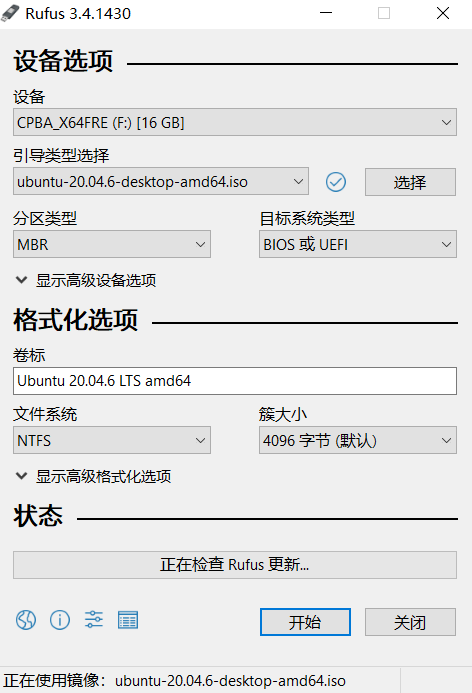

# Win10安装Ubuntu20.04双系统
> 以下是联想拯救者R720安装Ubuntu20.04成功的过程记录

## 一、准备工作
- U盘（我使用的16G）
- Ubuntu20.04LTS镜像
[清华大学开源软件镜像站](https://mirrors.tuna.tsinghua.edu.cn/ubuntu-releases/20.04/)
- Rufus-1008.05kb启动工具
[下载地址](https://link.csdn.net/?target=https%3A%2F%2Fpan.baidu.com%2Fs%2F1hmMkLOdCj26dusJU7-JrBQ)
密码：om26

## 二、Window分区压缩盘
分出一个空的磁盘区域，用于安装ubuntu系统：
> 磁盘管理 -> 选择一个余量多的分区 -> 压缩卷 -> 分配想要的内存容量 -> 得到未分配的空间  
注：最好不要对未分配空间进行新建卷，这样在安装Ubuntu自定义分区的时候，方便区分哪块是单独分出来的空闲区域。

## 三、制作启动盘
示意图如下，注意本次最终安装时，文件系统选择FAT32  

## 四、安装Ubuntu
- Q1: 如何进入BIOS
> 联想电脑F12进入BIOS
其他品牌电脑可参考：https://www.jb51.net/os/82023.html

- Q2：无法识别制作的启动盘，BIOS没有USB选项
> 参考链接：https://blog.csdn.net/qq_44824148/article/details/129372810  
分区类型选择MBR，文件系统选择FAT32

- Q3: 安装Ubuntu时进入到grub界面卡住
> 制作启动盘不正确，重新制作。比如分区类型选择GPT，文件系统选择NTFS。

- Q4：安装过程中想取消这次安装，重新安装
> 可以的方式：回退 -> 试用Ubuntu -> 进入界面后选择关机，重新来

- Q5：如何自定义分区
> 参考链接：  
[1] https://zhuanlan.zhihu.com/p/631956066  
[2] https://cloud.tencent.com/developer/article/2085602  
以自己举例，空闲300G来安装Ubuntu，最终分区方案：  
efi：500M  
swap：16G  
/ 根目录：约60G  
/usr：约80G  
/home：约143.5G  
安装启动引导器的目录：/dev/sda（/boot的上级目录）
---
## 参考链接：   
[1] https://blog.csdn.net/hwh295/article/details/113409389   
[2] https://zhuanlan.zhihu.com/p/581408559  
[3] https://zhuanlan.zhihu.com/p/461271487?utm_id=0