# Linux基础教程
## 一、简介
> Linux 是一套免费使用和自由传播的类 Unix 操作系统，是一个基于 POSIX 和 UNIX 的多用户、多任务、支持多线程和多 CPU 的操作系统。  
Linux 能运行主要的 UNIX 工具软件、应用程序和网络协议。它支持 32 位和 64 位硬件。Linux 继承了 Unix 以网络为核心的设计思想，是一个性能稳定的多用户网络操作系统

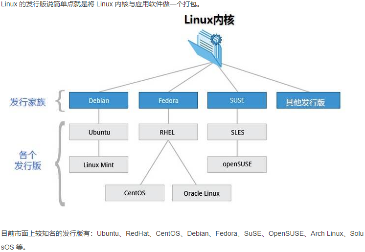
## 二、Linux系统启动过程
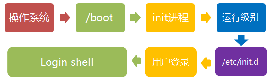  
5个阶段：
- 内核的引导  
  当计算机打开电源后，首先是BIOS开机自检，按照BIOS中设置的启动设备（通常是硬盘）来启动。  
  操作系统接管硬件以后，首先读入 /boot 目录下的内核文件。
- 运行init  
  - init 进程是系统所有进程的起点，你可以把它比拟成系统所有进程的老祖宗，没有这个进程，系统中任何进程都不会启动。  
  init 程序首先是需要读取配置文件 /etc/inittab。  
  - <mark>许多程序需要开机启动。它们在Windows叫做"服务"（service），在Linux就叫做"守护进程"（daemon）。</mark>init进程的一大任务，就是去运行这些开机启动的程序。
  但是，不同的场合需要启动不同的程序，比如用作服务器时，需要启动Apache，用作桌面就不需要。  
  - Linux允许为不同的场合，分配不同的开机启动程序，这就叫做"运行级别"（runlevel）。也就是说，启动时根据"运行级别"，确定要运行哪些程序。
- 系统初始化
- 建立终端
- 用户登录系统  
  一般来说，用户的登录方式有三种：
  （1）命令行登录
  （2）ssh登录
  （3）图形界面登录

- Linux关机
```
shutdown -h 20:25 # 系统会在今天20:25关机
shutdown -r +10 # 系统十分钟后重启
reboot = shutdown -r now # 立马重启
```
## 三、系统目录结构
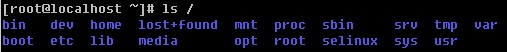

## 四、远程登陆
终端利用ssh登陆远程服务器
```
安装ssh：
yum install ssh

启动ssh：
service sshd start

登录远程服务器：
ssh -p 50022 my@127.0.0.1
输入密码：
my@127.0.0.1:

-p 后面是端口
my 是服务器用户名
127.0.0.1 是服务器 ip
回车输入密码即可登录
```
## 五、Linux文件基本属性
### 1. 介绍
- Linux 系统是一种典型的多用户系统，不同的用户处于不同的地位，拥有不同的权限。  为了保护系统的安全性，Linux 系统对不同的用户访问同一文件（包括目录文件）的权限做了不同的规定。  
- 在 Linux 中我们通常使用以下两个命令来修改文件或目录的所属用户与权限：  
<mark>
chown (change owner) ： 修改所属用户与组。  
chmod (change mode) ： 修改用户的权限。
</mark>

- 使用 ll 或者 ls –l 命令来显示一个文件的属性以及文件所属的用户和组
```
[root@www /]# ls -l
total 64
dr-xr-xr-x   2 root root 4096 Dec 14  2012 bin
dr-xr-xr-x   4 root root 4096 Apr 19  2012 boot
……
```
```
实例中，bin 文件的第一个属性用 d 表示。d 在 Linux 中代表该文件是一个目录文件。

在 Linux 中第一个字符代表这个文件是目录、文件或链接文件等等。

当为 d 则是目录
当为 - 则是文件；
若是 l 则表示为链接文档(link file)；
若是 b 则表示为装置文件里面的可供储存的接口设备(可随机存取装置)；
若是 c 则表示为装置文件里面的串行端口设备，例如键盘、鼠标(一次性读取装置)。
```
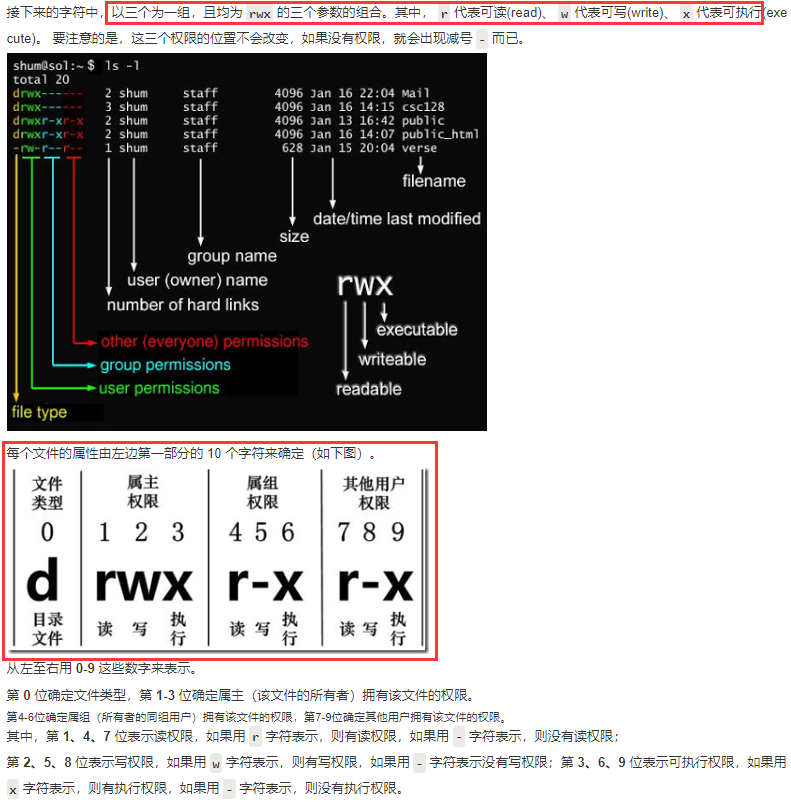
### 2. Linux文件属主和属组
```
[root@www /]# ls -l
total 64
drwxr-xr-x 2 root  root  4096 Feb 15 14:46 cron
drwxr-xr-x 3 mysql mysql 4096 Apr 21  2014 mysql
……
```
```
(1) 对于文件来说，它都有一个特定的所有者，也就是对该文件具有所有权的用户。
同时，在Linux系统中，用户是按组分类的，一个用户属于一个或多个组。
文件所有者以外的用户又可以分为文件所属组的同组用户和其他用户。
因此，Linux系统按文件所有者、文件所有者同组用户和其他用户来规定了不同的文件访问权限。
(2) 在以上实例中，mysql 文件是一个目录文件，属主和属组都为 mysql，属主有可读、可写、可执行的权限；与属主同组的其他用户有可读和可执行的权限；其他用户也有可读和可执行的权限。
对于 root 用户来说，一般情况下，文件的权限对其不起作用。
```
### 3. 更改文件属性
- chgrp：更改文件属组
```
chgrp [-R] 属组名 文件名 # -R：递归更改文件属组
```

- chown：更改文件属主，也可以同时更改文件属组
```
chown [–R] 属主名 文件名
chown [-R] 属主名：属组名 文件名

例：进入 /root 目录（~）将install.log的拥有者改为bin这个账号：
[root@www ~] cd ~
[root@www ~]# chown bin install.log
[root@www ~]# ls -l
-rw-r--r--  1 bin  users 68495 Jun 25 08:53 install.log
```

- chmod：更改文件9个属性
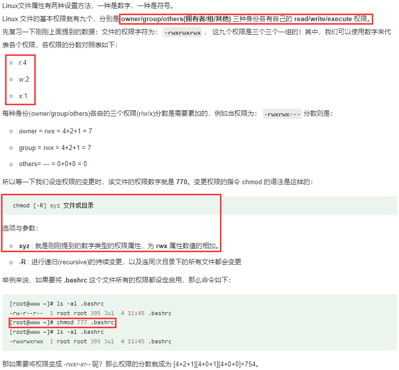
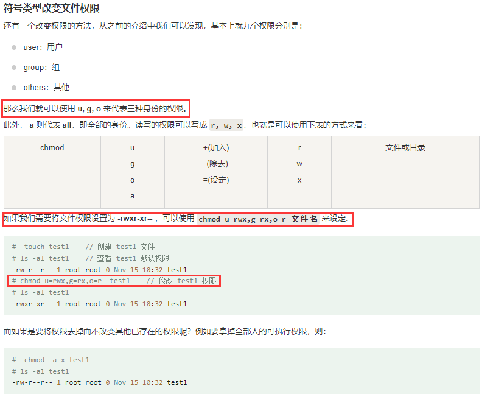

## 六、Linux文件与目录系统
1. Linux 链接概念  
  Linux 链接分两种，一种被称为硬链接（Hard Link），另一种被称为符号链接（Symbolic Link）。默认情况下，ln 命令产生硬链接
- 硬链接  
  - 硬连接指通过索引节点来进行连接。<mark>在 Linux 的文件系统中，保存在磁盘分区中的文件不管是什么类型都给它分配一个编号，称为索引节点号(Inode Index)。在 Linux 中，多个文件名指向同一索引节点是存在的。比如：A 是 B 的硬链接（A 和 B 都是文件名），则 A 的目录项中的 inode 节点号与 B 的目录项中的 inode 节点号相同，即一个 inode 节点对应两个不同的文件名，两个文件名指向同一个文件，A 和 B 对文件系统来说是完全平等的。删除其中任何一个都不会影响另外一个的访问。</mark>
  - <mark>硬连接的作用是允许一个文件拥有多个有效路径名，这样用户就可以建立硬连接到重要文件，以防止“误删”的功能</mark>。其原因如上所述，因为对应该目录的索引节点有一个以上的连接。只删除一个连接并不影响索引节点本身和其它的连接，只有当最后一个连接被删除后，文件的数据块及目录的连接才会被释放。也就是说，文件真正删除的条件是与之相关的所有硬连接文件均被删除。
- 软链接  
  - 另外一种连接称之为符号连接（Symbolic Link），也叫软连接。<mark>软链接文件有类似于 Windows 的快捷方式</mark>。它实际上是一个特殊的文件。在符号连接中，文件实际上是一个文本文件，其中包含的有另一文件的位置信息。比如：A 是 B 的软链接（A 和 B 都是文件名），A 的目录项中的 inode 节点号与 B 的目录项中的 inode 节点号不相同，A 和 B 指向的是两个不同的 inode，继而指向两块不同的数据块。但是 A 的数据块中存放的只是 B 的路径名（可以根据这个找到 B 的目录项）。<mark>A 和 B 之间是“主从”关系，如果 B 被删除了，A 仍然存在（因为两个是不同的文件），但指向的是一个无效的链接</mark>。
- 实验
  ```
    [oracle@Linux]$ touch f1          #创建一个测试文件f1
    [oracle@Linux]$ ln f1 f2          #创建f1的一个硬连接文件f2
    [oracle@Linux]$ ln -s f1 f3       #创建f1的一个符号连接文件f3
    [oracle@Linux]$ ls -li            # -i参数显示文件的inode节点信息
    total 0
    9797648 -rw-r--r--  2 oracle oinstall 0 Apr 21 08:11 f1
    9797648 -rw-r--r--  2 oracle oinstall 0 Apr 21 08:11 f2
    9797649 lrwxrwxrwx  1 oracle oinstall 2 Apr 21 08:11 f3 -> f1
  ```
  从上面的结果中可以看出，硬连接文件 f2 与原文件 f1 的 inode 节点相同，均为 9797648，然而符号连接文件的 inode 节点不同。
  ```
    [oracle@Linux]$ echo "I am f1 file" >>f1
    [oracle@Linux]$ cat f1
    I am f1 file
    [oracle@Linux]$ cat f2
    I am f1 file
    [oracle@Linux]$ cat f3
    I am f1 file
    [oracle@Linux]$ rm -f f1
    [oracle@Linux]$ cat f2
    I am f1 file
    [oracle@Linux]$ cat f3
    cat: f3: No such file or directory
   ```
   通过上面的测试可以看出：<mark>当删除原始文件 f1 后，硬连接 f2 不受影响，但是符号连接 f3 文件无效</mark>
- 总结
  依此您可以做一些相关的测试，可以得到以下全部结论：
  ```
    1) 删除符号连接f3,对f1,f2无影响；
    2) 删除硬连接f2，对f1,f3也无影响；
    3) 删除原文件f1，对硬连接f2没有影响，导致符号连接f3失效；
    4) 同时删除原文件f1,硬连接f2，整个文件会真正的被删除。
  ```
## 七、Linux磁盘管理
Linux 磁盘管理好坏直接关系到整个系统的性能问题。  
<mark>Linux 磁盘管理常用三个命令为 df、du 和 fdisk。  
> df（英文全称：disk free）：列出文件系统的整体磁盘使用量  
> du（英文全称：disk used）：检查磁盘空间使用量  
> fdisk：用于磁盘分区  
</mark>

### df
<mark>df命令参数功能：检查文件系统的磁盘空间占用情况。可以利用该命令来获取硬盘被占用了多少空间，目前还剩下多少空间等信息。</mark>
```
df [-ahikHTm] [目录或文件名]

选项与参数：
-a ：列出所有的文件系统，包括系统特有的 /proc 等文件系统；
-k ：以 KBytes 的容量显示各文件系统；
-m ：以 MBytes 的容量显示各文件系统；
-h ：以人们较易阅读的 GBytes, MBytes, KBytes 等格式自行显示；
-H ：以 M=1000K 取代 M=1024K 的进位方式；
-T ：显示文件系统类型, 连同该 partition 的 filesystem 名称 (例如 ext3) 也列出；
-i ：不用硬盘容量，而以 inode 的数量来显示
```
实例 将 /etc 底下的可用的磁盘容量以易读的容量格式显示
```
[root@www ~]# df -h /etc
Filesystem            Size  Used Avail Use% Mounted on
/dev/hdc2             9.5G  3.7G  5.4G  41% /
```

### du
Linux du 命令也是查看使用空间的，但是与 df 命令不同的是 <mark>Linux du 命令是对文件和目录磁盘使用的空间的查看，还是和df命令有一些区别的，这里介绍 Linux du 命令</mark>。
```
du [-ahskm] 文件或目录名称

选项与参数：
-a ：列出所有的文件与目录容量，因为默认仅统计目录底下的文件量而已。
-h ：以人们较易读的容量格式 (G/M) 显示；
-s ：列出总量而已，而不列出每个各别的目录占用容量；
-S ：不包括子目录下的总计，与 -s 有点差别。
-k ：以 KBytes 列出容量显示；
-m ：以 MBytes 列出容量显示；
```
实例：检查根目录底下每个目录所占用的容量
```
[root@www ~]# du -sm /*
7       /bin
6       /boot
.....中间省略....
0       /proc
.....中间省略....
1       /tmp
3859    /usr     <==系统初期最大就是他了啦！
77      /var
```

### fdisk
fdisk 是 Linux 的磁盘分区表操作工具。
```
fdisk [-l] 装置名称

选项与参数：
-l ：输出后面接的装置所有的分区内容。若仅有 fdisk -l 时， 则系统将会把整个系统内能够搜寻到的装置的分区均列出来。
```
- 磁盘格式化
磁盘分割完毕后自然就是要进行文件系统的格式化，格式化的命令非常的简单，使用 mkfs（make filesystem） 命令。
  ```
  mkfs [-t 文件系统格式] 装置文件名

  选项与参数：
  -t ：可以接文件系统格式，例如 ext3, ext2, vfat 等(系统有支持才会生效)
  ```
- 磁盘检验  
  fsck（file system check）用来检查和维护不一致的文件系统。
  若系统掉电或磁盘发生问题，可利用fsck命令对文件系统进行检查。
  ```
  fsck [-t 文件系统] [-ACay] 装置名称
  ```

- 磁盘挂载与卸除  
  <mark>Linux 的磁盘挂载使用 mount 命令，卸载使用 umount 命令</mark>。
  ```
  （1）磁盘挂载语法：
    mount [-t 文件系统] [-L Label名] [-o 额外选项] [-n]  装置文件名  挂载点

  （2）磁盘卸载命令 umount 语法：
    umount [-fn] 装置文件名或挂载点

    选项与参数：
    -f ：强制卸除！可用在类似网络文件系统 (NFS) 无法读取到的情况下；
    -n ：不升级 /etc/mtab 情况下卸除。
  ```
  实例
  ```
    # 用默认的方式，将刚刚创建的 /dev/hdc6 挂载到 /mnt/hdc6 上面
    [root@www ~]# mkdir /mnt/hdc6
    [root@www ~]# mount /dev/hdc6 /mnt/hdc6
    [root@www ~]# df
    Filesystem           1K-blocks      Used Available Use% Mounted on
    .....中间省略.....
    /dev/hdc6              1976312     42072   1833836   3% /mnt/hdc6

    # 卸载/dev/hdc6
    [root@www ~]# umount /dev/hdc6    
  ```
  
  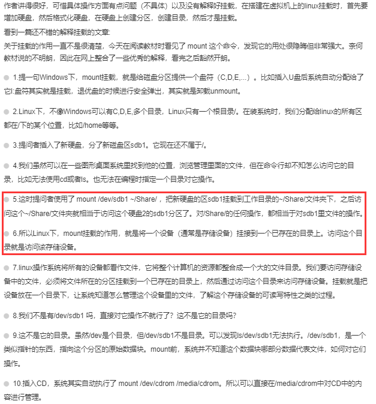

  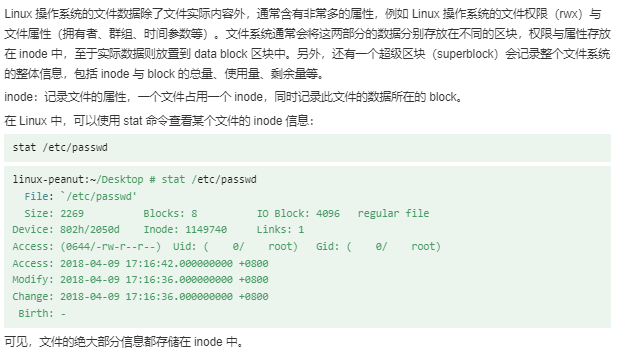

## 八、Linux vi/vim
1. vi/vim的使用
基本上 vi/vim 共分为三种模式，<mark>命令模式（Command Mode）、输入模式（Insert Mode）和命令行模式（Command-Line Mode）</mark>。
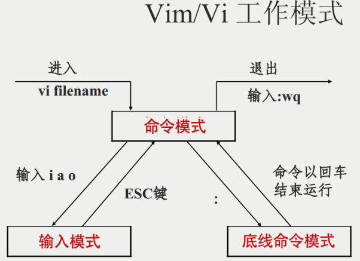

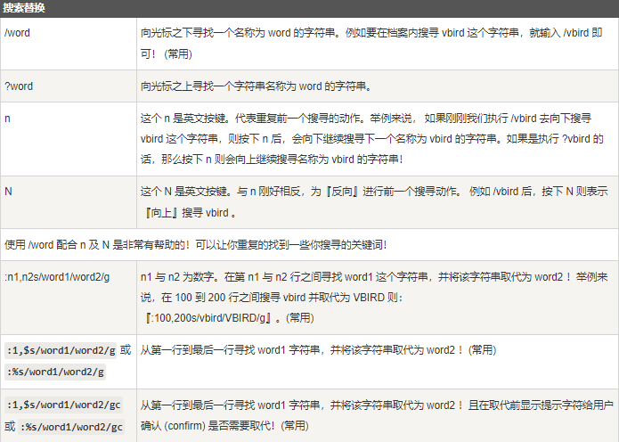

- vim环境的变更  
:set nu	显示行号，设定之后，会在每一行的前缀显示该行的行号

## 九、Linux yum命令
- yum（ Yellow dog Updater, Modified）是一个在 Fedora 和 RedHat 以及 SUSE 中的 Shell 前端软件包管理器。(如CentOS)
- 基于 RPM 包管理，能够从指定的服务器自动下载 RPM 包并且安装，可以自动处理依赖性关系，并且一次安装所有依赖的软件包，无须繁琐地一次次下载、安装。
- yum 提供了查找、安装、删除某一个、一组甚至全部软件包的命令，而且命令简洁而又好记。
```
yum 语法:
  yum [options] [command] [package ...]

  options：可选，选项包括-h（帮助），-y（当安装过程提示选择全部为 "yes"），-q（不显示安装的过程）等等。
  command：要进行的操作。
  package：安装的包名。
```

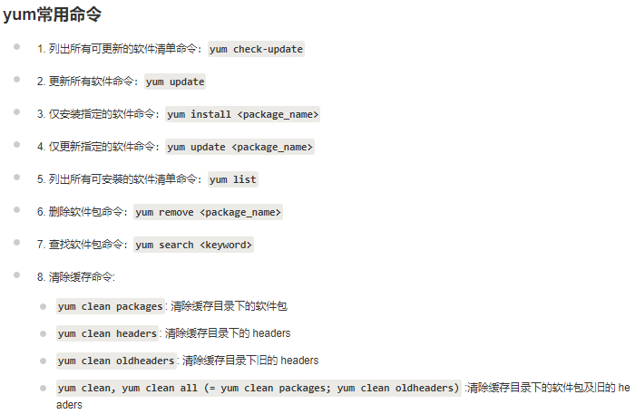

实例1：利用 yum 的功能，找出以 pam 为开头的软件名称有哪些？
```
[root@www ~]# yum list pam*
Installed Packages
pam.i386                  0.99.6.2-3.27.el5      installed
pam_ccreds.i386           3-5                    installed
pam_krb5.i386             2.2.14-1               installed
pam_passwdqc.i386         1.0.2-1.2.2            installed
pam_pkcs11.i386           0.5.3-23               installed
pam_smb.i386              1.1.7-7.2.1            installed
Available Packages <==底下则是『可升级』的或『未安装』的
pam.i386                  0.99.6.2-4.el5         base
pam-devel.i386            0.99.6.2-4.el5         base
pam_krb5.i386             2.2.14-10              base
```
实例2：对于 Linux 软件安装时提示缺失库的，可以使用 yum 的 provides 参数查看 libstdc++.so.6 的库文件包含在那个安装包中只需要执行：
```
yum provides libstdc++.so.6
```
然后按查询到安装包包名，使用 yum install 安装即可。

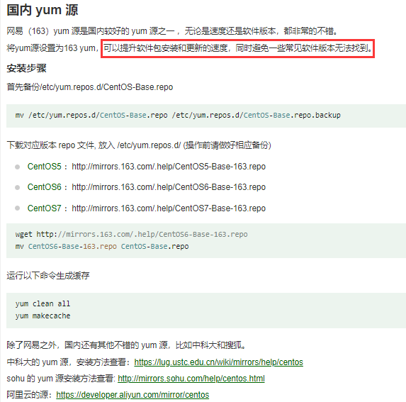

## 十、Linux apt命令
- apt（Advanced Packaging Tool）是一个在 Debian 和 Ubuntu 中的 Shell 前端软件包管理器。
- apt 命令提供了查找、安装、升级、删除某一个、一组甚至全部软件包的命令，而且命令简洁而又好记。
- apt 命令执行需要超级管理员权限(root)。
```
apt 语法:
  apt [options] [command] [package ...]


  options：可选，选项包括 -h（帮助），-y（当安装过程提示选择全部为"yes"），-q（不显示安装的过程）等等。
  command：要进行的操作。
  package：安装的包名。
```

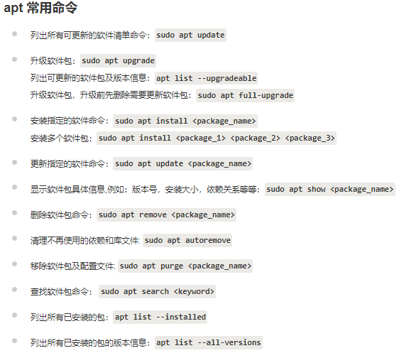

实例：
```
sudo apt update # 查看一些可更新的包

sudo apt upgrade # 升级安装包

sudo apt install <package_name> --no-upgrade # 如果我们想安装一个软件包，但如果软件包已经存在，则不要升级它，可以使用 –no-upgrade 选项:

sudo apt install <package_name> --only-upgrade # 只想升级，不要安装可以使用 --only-upgrade 参数

sudo apt install <package_name>=<version_number> # 如果需要设置指定版本的语法格式

apt search libimobile # 查找名为 libimobile 的相关包

apt show pinta # 查看 pinta 包的相关信息

apt list --upgradeable # 列出可更新的软件包

sudo apt autoremove # 清理不再使用的依赖和库文件

```

---
## 参考链接
[1] https://www.runoob.com/linux/linux-tutorial.html