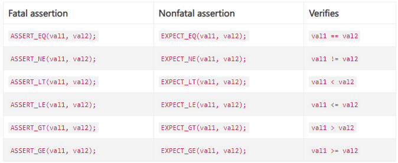
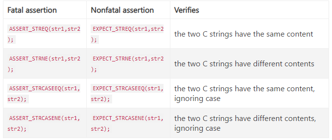

## GoogleTest Primer

### 一、介绍
- GoogleTest支持各种测试，不仅是单元测试(UT)；
- GoogleTest的优势：
  > （1）测试应该是<mark>独立的和可重复的</mark>。调试由于其他测试而成功或失败的测试是一件痛苦的事。 googletest 通过在不同的对象上运行每个测试来隔离测试。<mark>当一个测试失败时，可以单独调试那一个测试。</mark>  
  > （2）测试应该组织良好并反映测试代码的结构。 <mark>googletest 将相关测试分组到可以共享数据和子程序的测试套件中</mark>。这种常见的模式很容易识别并使测试易于维护。当人们切换项目并开始使用新的代码库时，这种一致性特别有用。  
  > （3）测试应该是<mark>可移植的和可重复使用的</mark>。谷歌有很多平台中立的代码；它的测试也应该是平台中立的。 googletest 适用于不同的操作系统，使用不同的编译器。  
  > （4）当测试失败时，他们应该提供尽可能多的关于问题的信息。 <mark>googletest 不会在第一次测试失败时停止。相反，它只会停止当前测试并继续下一个测试。</mark>可以设置报告非致命故障的测试，然后当前测试继续。因此，可以在单个运行-编辑-编译周期中检测和修复多个错误。  
  > （5）测试框架将测试编写者从杂活中解放出来，让他们专注于测试内容。 googletest 自动跟踪定义的所有测试，并且不需要用户枚举它们以运行它们。  
  > （6）编写测试便捷。使用 googletest，您<mark>可以在测试之间重用共享资源</mark>，只需要编写一次SetUp和TearDown函数而不用每个测试都独立编写初始化和资源清理函数。

### 二、断言
- GTEST的断言是类似函数调用的宏定义，对类或者函数使用断言来判断它的行为。当一个断言失败了，GTEST会打印这个测试断言的源文件、行数以及失败信息。也可以提供定制的错误信息接在GTEST的错误信息后面。

- `ASSERT_*`版本在断言失败时产生致命错误，并且终止当前函数；  
`EXPECT_*`版本则产生非致命错误，且不会终止当前函数（可以报告多个错误）。  

- 基本的断言  
`ASSERT_TRUE(condition); ASSERT_FALSE(condition); EXPECT_TRUE(condition); EXPECT_FALSE(condition);`

- 比较断言  


- 注意事项  
  （1）用户自定义类型仅仅当定义了比较操作时，断言才能够比较的对象的大小，但是这不被Google的C++类型规范所提倡；  
  （2）<mark>ASSERT_EQ()在比较指针时比较的是指针的值</mark>，当比较两个C风格的字符串时，将会比较他们是否有相同的<mark>内存地址</mark>，而不是有相同的值。因此在比较C风格字符串的时候应当使用`ASSERT_STREQ()`，但是在比较两个string对象的时候，应当使用`ASSERT_EQ`；  
  （3）在进行指针的比较时应当使用`*_EQ(ptr, nullptr)`和`*_NE(ptr, nullptr)`代替`*_EQ(ptr, NULL)`和`*_NE(ptr, NULL)`，因为nullptr被定义了类型而NULL却没有；  
  （4）当比较浮点数时应该使用浮点数断言来避免近似值导致的问题。

- 字符串比较  
这类断言用于比较C风格的字符串，在比较string的时候，使用`EXPECT_EQ, EXPECT_NE`
  


### 三、简单的测试例子
```c++
// 第一个参数：测试套件；第二个参数：测试套件下该测试的名字
TEST(TestSuiteName, TestName) {
  ... test body ...
}

// 例：同一个测试套件FactorialTest下的HandlesZeroInput和HandlesPositiveInput测试
// Tests factorial of 0.
TEST(FactorialTest, HandlesZeroInput) {
  EXPECT_EQ(Factorial(0), 1);
}

// Tests factorial of positive numbers.
TEST(FactorialTest, HandlesPositiveInput) {
  EXPECT_EQ(Factorial(1), 1);
  EXPECT_EQ(Factorial(2), 2);
  EXPECT_EQ(Factorial(3), 6);
  EXPECT_EQ(Factorial(8), 40320);
}
```

### 四、Test Fixtures（为多个测试使用相同的配置）
- 当<mark>两个或更多的测试需要使用相似的数据时，可以使用`Test Fixture`</mark>。这可以对不同的测试重用相同的数据对象配置

- 流程：
    ```
    （1）从::testing::Test派生出一个类。用protected:开始它的类主体，因为需要从子类访问fixture成员；
    （2）在类中声明所有准备使用的对象；
    （3）如果需要，可以编写一个默认构造函数或SetUp()函数来为每个测试准备对象；（注：常见的错误是将SetUp()拼写为Setup()，在c++ 11中可以使用override来确保拼写正确）
    （4）如有必要，编写一个析构函数或TearDown()函数以释放您在SetUp()中分配的所有资源；
    （5）如果需要，定义要共享的测试的子程序。
    ```

- 当使用fixture时，<mark>使用`TEST_F()`代替`TEST()`</mark>，因为`TEST_F()`允许你在`Test Fixture`中获取对象和子程序（第一个测试套件参数就是`Test Fixture`类名）

    > （1）对于每个`TEST_F()`来说，GTEST在运行时都会创建一个新的`test fixture`对象，并且通过`SetUp()`立刻初始化这个对象，再运行测试，结束后通过调用`TearDown()`来进行清理工作，最后将删除这个`test fixture`对象；  
    > （2）在同一个测试套件中的不同测试拥有不同的`test fixture`对象，<mark>GTEST在新建下一个`test fixture`对象时总是会先删除上一个`test fixture`对象，并且不会在多个不同的测试中重用一个`test fixture`对象。所以如果任何测试改变了它的`test fixture`对象，并不会影响其他测试的`test fixture`对象。</mark>

- 示例程序（对一个FIFO队列类Queue编写测试）：
    ```c++
    // 接口
    template <typename E>  // E is the element type.
    class Queue {
    public:
      Queue();
      void Enqueue(const E& element);
      E* Dequeue();  // Returns NULL if the queue is empty.
      size_t size() const;
    ...
    };
    ```

    ```c++
    // Fixture类
    class QueueTest : public ::testing::Test {
    protected:
      void SetUp() override {
        q1_.Enqueue(1);
        q2_.Enqueue(2);
        q2_.Enqueue(3);
    }

      // void TearDown() override {}

      Queue<int> q0_;
      Queue<int> q1_;
      Queue<int> q2_;
    };
    ```

    ```c++
    TEST_F(QueueTest, IsEmptyInitially) {
      EXPECT_EQ(q0_.size(), 0);
    }

    TEST_F(QueueTest, DequeueWorks) {
      int* n = q0_.Dequeue();
      EXPECT_EQ(n, nullptr);

      n = q1_.Dequeue();
      ASSERT_NE(n, nullptr);
      EXPECT_EQ(*n, 1);
      EXPECT_EQ(q1_.size(), 0);
      delete n;

      n = q2_.Dequeue();
      ASSERT_NE(n, nullptr);
      EXPECT_EQ(*n, 2);
      EXPECT_EQ(q2_.size(), 1);
      delete n;
    }
    ```
    
    以上测试进行的过程步骤：
    ```
    1. GTEST构建一个QueueTest对象t1；  
    2. t1.SetUp()初始化t1；  
    3. 第一个测试在t1上运行；  
    4. t1.TearDown()在第一个测试结束时进行清理；  
    5. 析构t1；  
    6. 在进行另外一个QueueTest对象测试DequeueWorks测试时，重复上述步骤  
    ```

### 五、调用测试
- `TEST()`和`TEST_F()`向googletest隐式注册其测试。与许多其他C++测试框架不同，不必重新列出所有已定义的测试即可运行它们；
- 定义测试后，可以使用`RUN_ALL_TESTS()`运行它们，<mark>如果所有测试成功，将返回0，否则返回1</mark>。`RUN_ALL_TESTS()`在链接单元中运行所有测试，它们可以来自不同的测试套件，甚至来自不同的源文件。

### 六、编写main()函数
- 编写模板：
```c++
#include "this/package/foo.h"

#include "gtest/gtest.h"

namespace my {
namespace project {
namespace {

// The fixture for testing class Foo.
class FooTest : public ::testing::Test {
 protected:
  // You can remove any or all of the following functions if their bodies would
  // be empty.

  FooTest() {
     // You can do set-up work for each test here.
  }

  ~FooTest() override {
     // You can do clean-up work that doesn't throw exceptions here.
  }

  // If the constructor and destructor are not enough for setting up
  // and cleaning up each test, you can define the following methods:

  void SetUp() override {
     // Code here will be called immediately after the constructor (right
     // before each test).
  }

  void TearDown() override {
     // Code here will be called immediately after each test (right
     // before the destructor).
  }

  // Class members declared here can be used by all tests in the test suite
  // for Foo.
};

// Tests that the Foo::Bar() method does Abc.
TEST_F(FooTest, MethodBarDoesAbc) {
  const std::string input_filepath = "this/package/testdata/myinputfile.dat";
  const std::string output_filepath = "this/package/testdata/myoutputfile.dat";
  Foo f;
  EXPECT_EQ(f.Bar(input_filepath, output_filepath), 0);
}

// Tests that Foo does Xyz.
TEST_F(FooTest, DoesXyz) {
  // Exercises the Xyz feature of Foo.
}

}  // namespace
}  // namespace project
}  // namespace my

int main(int argc, char **argv) {
  ::testing::InitGoogleTest(&argc, argv);
  return RUN_ALL_TESTS();
}
```

### 七、已知的限制
- GTEST被设计成线程安全的。在使用pthread的系统上，GTEST的实现是线程安全的，而在其他系统(如Windows)上多线程并发使用Google Test的断言并不安全。一般情况下断言都是在主线程中进行的，因此在绝大多数测试中这并不会产生问题

### Reference 
[1] [官网使用说明指导](https://google.github.io/googletest/)  
[2] [github仓链接](https://github.com/google/googletest)  
[3] [GTEST做C++单元测试初级教程（GTEST Prime译文）](https://www.jianshu.com/p/c7c702c0abb9)