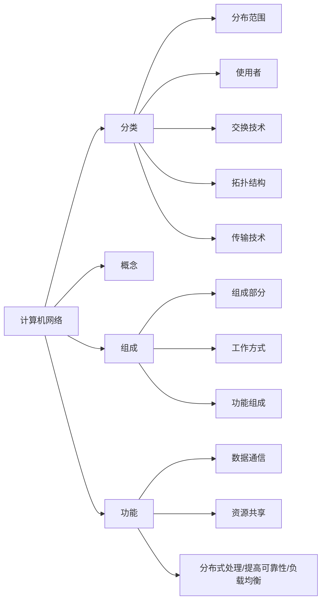

# 计算机网络-王道考研

视频链接：https://www.bilibili.com/video/BV19E411D78Q?p=1&vd_source=5ca8c9858efdf576a9c470964f99463a

[toc]

# 第一章

## 1、基本概念

- 计算机网络重点：网络体系结构下，典型网络（以太网） + 协议 + 网络设备

  应用层

  表示层

  会话层

  传输层

  网络层

  数据链路层

  物理层

- 计算机网络：是一个将分散的、具有独立功能的计算机系统，通过**通信设备与线路**连接起来，由功能完善的**软件**实现**资源共享**和**信息传递**的系统。

- 计算机网络的功能：

  1）**数据通信**（连通性）

  2）**资源共享** （硬件、软件、数据）

  3）分布式处理 （多态计算机各自承担同一工作任务的不同部分，Hadoop平台）

  4）提高可靠性（替代机）

  5）负载均衡

- 计算机网络的组成

  1）组成部分：硬件、软件、协议

  2）工作方式：

  - 边缘部分 （用户直接使用，如C/S方式，P2P方式）
  - 核心部分 （为边缘部分服务）

  3）功能组成：

  - **通信子网 （实现数据通信，各种传输介质、通信设备、相应的网络协议组成）**

    物理层：集线器、中继器

    数据链路层：交换机、网桥

    网络层：路由器

  - **资源子网 （实现资源共享/数据处理 ，实现资源共享功能的设备和软件的集合）**

    会话层

    表示层

    传输层

- 计算机网络的分类

  1）按分布范围：广域网WAN（交换技术），城域网WAN、局域网WAN、个人区域网WAN（后三类是广播技术）。

  2）按使用者：公用网、专用网。

  3）按交换技术：电路交换、报文交换、分组交换。

  4）按拓扑结构：总线型、星型、环型、网状型（常用于广域网）。

  5）按传输技术：广播式网络（共享公共通信信道）、点对点网络（分组存储转发和路由选择机制）。