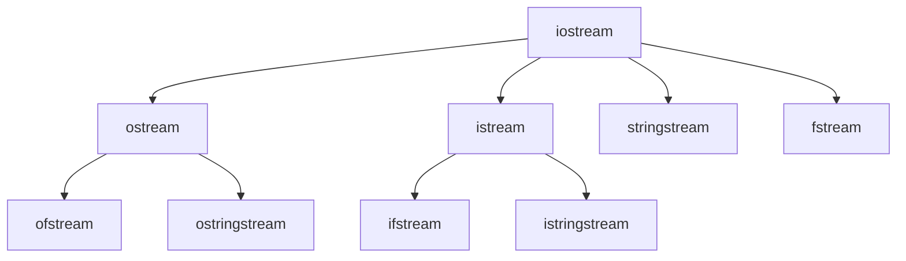

# 《C++ Primer第五版》笔记

视频链接：https://www.bilibili.com/video/BV1z64y1U7hs/?p=36&spm_id_from=333.880.my_history.page.click&vd_source=5ca8c9858efdf576a9c470964f99463a

## P7 类

### 7.1 定义抽象数据类型

1、类的基本思想是**数据抽象（接口与实现分离）和封装（把实现隐藏起来）**。

2、this是一个**指针常量**（包含类对象本身的地址），不允许改变指针里的地址。this的类型是(Sales_data* const)。

- 【底层const】常量指针：const int *PtrConst；// **指向常量的指针**

  底层const：指向的或者绑定的是const。不能通过解引用指针的方式，修改变量的值。称指针为常量的指针。

- 【顶层const】指针常量：int* const ConstPtr = &a；// 必须初始化，**指针本身是常量**

  顶层const：对象本身是const。指针在定义初始化之外，不能被赋值修改。称指针为指针常量。

3、定义一个返回this对象的函数

```C++
// 模拟复合运算符+=，为了和+=一致，返回为左值。
Sales_data& Sales_data::combine(const Sales_data &rhs) // right hand side
{
    units_sold += rhs.units_sold;
    revenue += rhs.revenue;
    return *this; // 返回调用该函数的对象
}
```

4、IO对象不能拷贝，只能引用。

5、拷贝、赋值和析构构造函数，如果没有定义，编译器将会提供合成的默认版本（default）。

**管理动态内存（new）的类，通常不能依赖于编译器合成的版本。（使用vector或string除外）**

---

### 7.2 友元

6、友元：允许其他类或函数（比如非类成员函数）访问自己的非公有成员。（友元不是类的一部分）

```C++
class Screen {
    // Window_mgmr的成员可以访问Screen类的私有部分
    friend class Window_mgmr;
    // 不对整个类开放，只对clear函数开放
    friend void Window_mgmr::clear(ScreenIndex);
}
```

令成员函数作为友元时，注意顺序：

- 定义Window_mgmt类，声明clear函数，**但不能定义它**；
- 定义Screen，包括对于clear的友元声明；
- 定义clear，此时才能使用Screen的成员。

---

### 7.3 类的其他特性

7、类的内部进行成员函数的定义，相当于隐式内敛（inline）。**也可以在类外进行定义，函数头加inline设为内联函数**。

8、可变数据成员：mutable。即使在一个const对象内也能被修改。

```c++
class Screen {
public:
    void some_member() const; // 对于const成员函数来说，this指针是const的，指向常量的指针。
private:
    mutable size_t access_ctr; // 即使在一个const对象内也能被修改
}

void Screen::some_member() const
{
    ++access_ctr;
}
```

9、类的前向申明

- 类的声明可以和定义分离，前向声明，在定义之前是一个不完整类型。（不能用于定义一个对象，因为需要知道对象占多大的空间）

- **不完整类型可以定义指向该类型的指针或引用，也可以作为函数声明中的参数或返回类型。**

```C++
class Screen; // 类的前向声明

class Link_screen {
    Screen window; // 错误，不完整类型
    Link_screen *next; // 正确，一旦类名字出现后，就被认为是声明过了
    Link_screen *prev;
}
```

---

### 7.4 类的作用域

10、类型名的定义应该放到类的开始处。

```C++
typedef double Money;
class Acount {
public:
    Money balance() { return bal; } // 使用外层作用域的Money
private:
    typedef double Money; // 错误，重复定义，编译器并不负责
    Money bal;
}
```

11、类的成员函数在实现定义时，用到的类/函数等，必须已经完成声明。

---

### 7.5 构造函数再探

12、如果成员是const、引用或者属于某种未提供默认构造函数的类类型，必须通过构造函数初始化列表提供初始值。

const和引用不属于赋值。

13、**构造函数初始值列表的顺序，不会影响实际的初始化顺序。**

```C++
class X {
    int i;
    int j;
    
public:
    X(int val) : j(val), i(j) {} // error, 按照定义顺序，i在j之前被初始化。
}
```

14、委托构造函数：把自己的一些（或全部）职责给了其他构造函数。

15、如果构造函数支持一个实参的调用，那么也就定义了从参数类型向类类型隐式转换的规则 （只允许一步类类型转换）-> explicit（抑制，一步也不允许隐式转换，explicit定义后只能用于直接初始化不能用于拷贝形式初始化）

16、聚合类：（可以使用初始值列表初始化，顺序要注意）

- 所有成员都是public
- 没有定义任何构造函数
- 没有类内初始值
- 没有基类，也没有virtual函数

17、字面值类（constexpr）

### 7.6 类的静态成员

18、static函数不包含this指针，所以不能定义成const函数。

19、静态成员不占用对象的内存。存在于任何对象之外，所有对象共享。

20、static关键字出现在类内部的声明语句中，外部定义不要static关键字。（内部声明，外部定义）

21、静态数据类型可以是不完全类型。（**static成员、指针都可以是不完全类型，对象必须是完全类型，需要知道分配多少空间**）

22、可以使用静态成员作为默认实参，因为它本身并不是对象的一部分。

## P8 C++标准库：IO类

### 8.1 IO类

23、IO库类型和头文件（w表示wchar_t）

| 头文件   | 类型                                                         |
| -------- | ------------------------------------------------------------ |
| iostream | istream, wistream 从流中读取；ostream, wostream 写到流中去；iostream, wiostream 对流进行读写 |
| fstream  | ifstream, wifstream 从文件中读取；ofstream, wofstream 写到文件中去；fstream, wfstream 读写文件 |
| sstream  | istringstream, wistringstream 从string对象中读取；ostringstream, wostringstream 写到string对象中去；                          stringstream, wstringstream 对string对象进行读写 |

24、IO对象不能拷贝或赋值。

25、IO库条件状态。

### 8.2 文件输入输出

26、每个流文件都有一个关联的**文件模式**（fille mode）

|             | 文件模式                                 |
| ----------- | ---------------------------------------- |
| in          | 以读方式打开                             |
| out         | 以写方式打开                             |
| app(append) | 追加：每次写操作前均定位到文件末尾       |
| ate(at end) | 每次打开文件后立即定位到末尾             |
| trunc       | 截断：如果打开的文件存在，其内容将被丢弃 |
| binary      | 以二进制方式进行IO                       |

### 8.3 string流

27、IO类继承关系



28、

```C++
sstream strm(s); // strm是一个sstream对象，保存string s的一个拷贝。此构造函数是explicit的。
strm.str(); // 返回strm所保存的string的拷贝。
strm.str(s); // 将string s拷贝到strm中。
```

29、string代表的是内存，istringstream是从内存读取数据，ostringstream是将数据写入内存。

## P9 C++标准库：容器

### 9.1 顺序容器概述

30、C++的容器分为顺序容器、关联容器。

**每种容器都是性能和功能的权衡（添加、删除、非顺序访问）**

31、常见顺序容器

| 头文件       | 类型                                                         |
| ------------ | ------------------------------------------------------------ |
| vector       | 可变大小数组。支持快速随机访问。在尾部之外的位置插入或删除元素可能很慢。 |
| deque        | 双端队列。**支持快速随机访问。在头尾位置插入/删除速度很快。** |
| list         | 双向链表。只支持双向顺序访问。在list中任何位置进行插入/删除操作速度都很快。 |
| forward_list | 单向链表。只支持单向顺序访问。在链表任何位置进行插入/删除操作速度都很快。 |
| array        | 固定大小数组。支持快速随机访问。不能添加或删除元素。（作用是替换内置数组如int a[]） |
| string       | 和vector相似的容器，但专门用于保存字符。随机访问快。在尾部插入/删除速度快。 |

32、开始不确定用哪种容器，首选vector。注意使用容器的公共操作比如：迭代器而不是下标。后面若扩展迁移到其他容器，代码可以复用。

### 9.2 容器库概述

33、迭代器范围一般是由一对迭代器表示（左闭合区间）：[begin, end)。

34、一个容器初始化为另一个容器的拷贝时，容器类型和元素类型必须相同。

35、内置数组不支持拷贝或赋值。

```C++
int digs[5] = {0, 1, 2, 3, 4};
int cpy[5] = digs; // error
```

36、容器赋值运算

```C++
c1 = c2 // c1中元素替换成c2中元素的拷贝，c1和c2必须有相同的类型
c = {a, b, c, ..} // 将c1中元素替换成初始化列表中元素的拷贝(array不适用)
swap(c1, c2) // 交换c1和c2中的元素。通常比c2向c1拷贝元素快得多。（相关的地址换了一下）
c1.swap(c2)
    
assign操作不适用于关联容器和array
seq.assign(b, e) // 将seq中的元素替换成迭代器b和e所表示的范围中的元素。迭代器b和e不能指向seq中的元素。
seq.assign(i1) // 将seq中的元素替换成初始化列表i1中的元素。
seq.assign(n, t) // 将seq中的元素替换为n和值为t的元素。
```

- **赋值相关运算会导致指向左边容器内部的迭代器、引用和指针失效。**
- 而swap操作将容器内容交换不会导致指向容器的迭代器、引用和指针失效（容器类型为array和string的情况除外）。array还是会进行拷贝。
- 赋值运算后，两者的大小都与后边容器的原大小相同。
- array不支持assign，也不允许花括号包围的值列表进行赋值。
- assign允许从一个不同但相容的类型赋值，或是从容器的一个子序列赋值。

37、容器关系运算操作

``` C++
vector<int> v1 = {1,3,5,7,9,12};
vector<int> v2 = {1,3,9}
vector<int> v3 = {1,3,5,7}
v1 < v2; // true
v1 < v3; // false
```

关系运算符左右两边必须类型相同。只有当其元素类型也定义了相应的比较运算符时，我们才可以使用关系运算符来比较两个容器。

### 9.3 顺序容器操作

38、向顺序容器添加元素

- **向一个vector、string或deque插入元素，会使得所有指向容器的迭代器、指针和引用失效**。

- ```C++
  c.insert(p,t) // 在迭代器p指向的元素之前创建一个值为t的元素。返回指向新添加元素的迭代器。
  c.insert(p,n,t) // 在迭代器p指向的元素之前插入n个值为t的元素。返回指向新添加的第一个元素的迭代器。
  c.insert(p,a.begin(),a.end())
  ```

- 可以通过insert实现：将元素插入到vector、deque和string中的任何位置，都是合法的。然而这样做可能很耗时。

- **使用emplace操作：构造元素而不是拷贝元素**。

39、在顺序容器中访问元素的操作

```C++
1）at和下标操作只适用于string、vector、deque和string。back不适用于forward_list。
2）c.back()和c.front()：返回c中尾/首元素的引用。若c为空，函数行为未定义。
3）c[n],c.at(n)：返回下标为n的元素的引用。
```

40、顺序容器的删除操作

```C++
1）这些操作会改变容器的大小，所以不适用于array。
2) forward_list有特殊版本的erase，不支持pop_back；vector和string不支持pop_front。
3）c.pop_back()/c.pop_front() // 删除c中尾、首元素，若c为空则函数行为未定义，函数返回void。
4）c.erase(p) // 删除迭代器p所指定的元素，返回一个指向被删除元素之后元素的迭代器。
5）c.erase(b,e) // 删除迭代器b和e所指定范围的元素。返回迭代器是e。删除范围是左闭合区间：[b,e)
6）c.clear()
```

- **删除deque中除首尾之外的任何元素都会使得迭代器、引用和指针都失效。指向vector或string中删除点之后位置的迭代器、引用和指针都会失效**。

41、特殊的forward操作

- 单向链表没有简单的方法来获取一个元素的前驱。
- before_begin(); // 获取单向链表首前的位置。 
- insert_after(); emplace_after(); // 返回一个指向最后一个插入元素的迭代器。
- erase_after(); // 返回一个指向被删元素之后元素的迭代器。

42、顺序容器大小操作

```C++
resize不适用于array
c.resize(n) // 调整c的大小为n个元素。若n<c.size()，则多出的元素被丢弃。若必须添加新元素，则对新元素进行值初始化。
c.resize(n,t) // 调整c的大小为n个元素。任何新添加的元素都初始化为值t。
```

- **如果resize缩小容器，则指向被删除元素的迭代器、引用和指针都会失效；对vector、string或deque进行resize可能导致迭代器、指针和引用失效。**
- resize可调整容器元素个数。

43、不要缓存end符合的迭代器，如auto end = v.end()是会存在问题的操作。（比如删除元素或增加元素扩容的情况）

### 9.4 vector对象是如何增长的

44、容器大小管理操作

```C++
shrink_to_fit只适用于vector、string和deque。
capacity和reserve只适用于vector和string。
c.shrink_to_fit(); // 请将capacity()减少为与size()相同大小
c.capacity(); // 不重新分配内存空间的化，c可以保存多少元素
c.reserve(n); // 分配至少能容纳n个元素的内存空间
```

- **capacity（容量）和size（有多少个元素）含义不一样**。

  0 | 1 | 2 | 3 | ... | 23 | 保留空间 |

  ​                       ↑size                 ↑capacity

- **reserve并不改变容器中元素的数量，它仅影响vector预分配多大的内存空间（容量）**。 

- vector扩容一般是翻一倍，具体看编译器版本实现。

### 9.5 额外的string操作

45、额外的构造函数

```C++
n, len2和pos2都是无符号值
string s(cp,n) // s是cp指向的数组中前n个字符的拷贝。此数组至少应该包含n个字符。
string s(s2,pos2) // s是string s2从下标pos2开始的字符的拷贝。若pos2>s2.size()，构造函数的行为未定义。
string s(s2,pos2,len2) // s是string s2从下标pos2开始len2个字符的拷贝。若pos2>s2.size()，构造函数的行为未定义。不管len2的值是多少，构造函数最多拷贝s2.size()-pos2个字符。
```

46、子字符串操作

```C++
s.substr(pos,n) // 返回一个string，包含s中从pos开始的n个字符的拷贝。pos的默认值为0。n的默认值为s.size()-pos，即拷贝从pos开始的所有字符。
```

47、插入操作

```C++
c.insert(s.size(), 5, '!'); // 在s末尾插入5个感叹号
c.erase(s.size()-5, 5); // 在s删除最后5个字符

// C风格字符数组的insert和assign版本
const char *cp = "Stately, plump Buck";
s.assign(cp, 7); // s = "Stately"
s.insert(s.size(), cp+7); // s = "Stately, plump Buck"

// 我们也可以指定来自其他string或字符串的字符插入到当前string中
string s = "some string", s2 = "some other string";
s.insert(0, s2); // 在s中位置0之前插入s2的拷贝
s.insert(0, s2, 0, s2.size()); // 在s[0]之前插入s2中s2[0]开始的s2.size()个字符
```

48、append和replace函数

```C++
// append操作是在string末尾进行插入操作的一种简写形式
string s("C++ Primer"), s2 = s;
s.insert(s.size(), "4th Ed.") // s = "C++ Primer 4th Ed."
s2.append("4th Ed."); // 等价方法， s=s2
// replace操作是调用erase和insert的一种简写形式
// 将"4th"替换为"5th"的等价方法
s.erase(11, 3); // s = "C++ Primer Ed."
s.insert(11, "5th"); // s = "C++ Primer 5th Ed."
// 从位置11开始，删除3个字符并插入"5th"
s2.replace(11, 3, "5th"); // 等价方法：s = s2
// s.replace(11, 3, "Fifth"); 也可以，长度无需一样
```

49、string搜索操作

```C++
// 搜索操作返回指定字符出现的下标，如果未找到则返回npos。
s.find(args) // 查找s中args第一次出现的位置
s.rfind(args) // 查找s中args最后一次出现的位置
s.find_first_of(args) // 在s中查找args中任何一个字符第一次出现的位置
s.find_last_of(args) // 在s中查找args中任何一个字符最后一次出现的位置
s.find_first_not_of(args) // 在s中查找第一个不在args中的字符
s.find_last_not_of(args) // 在s中查找最后一个不在args中的字符
    
// 每个函数都有4个重载版本
    args必须是以下形式
c, pos		// 从s中位置pos开始查找字符c。pos默认为0
s2, pos		// 从s中位置pos开始查找字符串s2。pos默认为0
cp, pos		// 从s中位置pos开始查找指针cp指向的以空字符结尾的C风格字符串。pos默认为0
cp, pos, n  // 从s中位置pos开始查找指针cp指向的数组的前n个字符。pos和n无默认值
```

- 每个搜索操作都返回一个string::size_type值。

- 判断搜索到结尾：string::npos。

50、s.compare的几种参数形式

```C++
s2 // 比较s和s2
pos1, n1, s2 // 将s中从pos1开始的n1个字符与s2进行比较
pos1, n1, s2, pos2, n2 // 将s中从pos1开始的n1个字符与s2中从pos2开始的n2个字符进行比较
    
cp // 比较s与cp指向的以空字符结尾的字符数组
pos1, n1, cp // 将s中从pos1开始的n1个字符，与cp指向的以空字符结尾的字符数组进行比较
pos1, n1, cp, n2 // 将s中从pos1开始的n1个字符与指针cp指向的地址开始的n2个字符进行比较
```

51、string和数值之间的转换

```C++
to_string(val) 	// 一组重载函数，返回数值val的string表示
// 返回s的起始子串（表示整数内容）的数值，返回类型分别是int,long,unsigned long,long long, unsigned long long，b表示转换所用的基数，默认值是10。p是size_t指针，用来保存s中第一个非数值字符的下标，p默认为0，即函数不保存下标。
stoi(s,p,b)
stol
stoul
stoll
stoull
// 返回s的起始字串（表示浮点数内容）的数值，返回值类型分别是float,double或long double。参数p的作用与整数转换函数中一样。
stof(s,p) 
stod(s,p)
stold(s,p)
    
std::string s2 = "pi=3.14!!!"
d = stod(s2.substr(s2.find_first_of("+-.0123456789")));
// d = stod(s2.substr(3)) -> d = stod("3.14!!!") -> d = 3.14
```

### 9.6 容器适配器

52、三个顺序容器适配器：stack、queue和priority_queue。

53、所有的适配器都要求容器具有添加、删除以及方便访问尾元素的能力。

54、所有容器适配器都支持的操作和类型

```C++
size_type	// 一种类型，足以保存当前类型的最大对象的大小。
value_type	// 元素类型
container_type	// 实现适配器的底层容器类型
A a;		// 创建一个名为a的空适配器
A a(c);		// 创建一个名为a的适配器，带有容器c的一个拷贝
关系运算符	 // 每个适配器都支持所有关系运算符：==、!=、<、<=、>和>=，这些运算符返回底层容器的比较结果
a.empty()
a.size()
swap(a,b)	// 交换a和b的内容，a和b必须有相同类型，包括底层容器类型也必须相同
a.swap(b)
```

55、栈默认基于deque实现，也可以在list或vector之上实现。

```C++
s.pop()	// 删除栈顶元素，但不返回该元素值
s.push(item) // 创建一个新元素压入栈顶，该元素通过拷贝或移动item而来，或者由args构造
s.emplace(args)
s.top() // 返回栈顶元素，但不将元素弹出栈
```

56、队列queue默认基于deque实现，priority_queue默认基于vector实现。queue也可以用list或vector实现，priority_queue也可以用deque实现。

```C++
q.pop() // 删除queue的首元素或priority_queue的最高优先级的元素，但不返回。
q.front() // 返回首元素或尾元素，但不删除该元素
q.back() // 只适用于queue
q.top() // 返回最高优先级元素，但不删除该元素，只适用于priority_queue
q.push(item) // 在queue末尾或priority_queue中恰当的位置创建一个元素，其值为item，或由args构造
q.emplace(args)
```

## P10 泛型算法

### 10.1 泛型算法概述

- 泛型的：可以用于不同类型的容器和不同类型的元素。
- 容器中定义的操作非常有限，其他操作（例如：**查找特定元素、替换或删除一个特定元素、排序**等）都是通过一组泛型算法来实现的。
- 大多数算法都定义在头文件algorithm中。头文件numeric还定义了一组算法。

```C++
int val = 42; // 将查找的值
auto result = find(vec.begin(), vec.end(), val);
std::cout << "val: " << val << (result == vec.end()? "存在" : "不存在") << std::endl;
```

- **泛型算法本身不会执行容器的操作，只会运用于迭代器上。 **

### 10.2 初始泛型算法

标准库提供了超过100个算法

57、只读算法

```C++
// 对vec中的元素求和，和的初值为0（第三个参数还决定了返回类型，以及+的使用）
int sum = accumulate(vec.begin(), vec.end(), 0);

// 接受单一迭代器来表示第二个序列的算法，都假设第二个序列至少与第一个序列一样长
// 第三个参数表示第二个序列的首元素
// roster1可以是vector<string>, roster2可以是list<const char *>，不要求同样容器，只要能够访问和比较即可。
equal(roster1.cbegin(), roster1.cend(), roster2.begin()); 
```

58、写容器元素的算法

```C++
fill(vec.begin(), vec.end(), 0); // 将每个元素重置为0
// 将容器的一个子序列设置为10
fill(vec.begin(), vec.begin() + vec.size/2, 10);

vector<int> vec;
// 第二个参数：要填充多少个元素
fill_n(vec.begin(), vec.size(), 0); // 将所有元素重置为0
fill_n(dest,n,val); // dest是起点，指向一个元素，而从dest开始至少需要包含n个元素
```

59、插入迭代器

- back_inserter，是定义在头文件iterator中的一个函数，接受指向容器的引用，返回绑定该容器的插入迭代器。
- **所有泛型算法都是通过迭代器操作的，不能调用容器的push_back等来增加元素**。

```C++
vector<int> vec;
auto it = back_inserter(vec); // 通过它赋值会将元素添加到vec中
*it = 42; // vec中现在有一个元素，值为42

vector<int< vec2;
// 正确：back_inserter创一个插入迭代器，可用来向vec添加元素
// 每次赋值，会在迭代器上调用push_back，改变了容器的元素个数
fill_n(back_inserter(vec2),10,0); // 添加10个元素到vec2
```

60、拷贝算法

```C++
int a1[] = {0,1,2,3,4,5,6,7,8,9};
int a2[sizeof(a1)/size(*a1)]; // a2与a1大小一样，*a1是首元素a1[0]
auto ret = copy(begin(a1),end(a1),a2); // 把a1的内容拷贝给a2

// 将所有值为0的元素改为42
replace(list.begin(),list.end(),0,42);

// 使用back_inserter按需要增长目标序列
replace_copy(ilist.begin(),ilist.end(),back_inserter(ivec),0,42);
// 上面的语句调用后，ilist并未改变，ivec包含ilist的一份拷贝
// 不过原来在ilist中值为0的元素在ivec中都变成了42
```

61、重排容器元素的算法

```C++
// 消除重复单词
void elimDups(vector<string> &words)
{
    // 按字典顺序排序
    sort(words.begin(), words.end());
    // unique消除相邻的重复项，unique函数把不重复的元素放在前面，把重复的放在后面
    // 排序在范围的前部，返回指向不重复区域之后一个位置的迭代器
    auto end_unique = unique(words.begin(), words.end());
    words.erase(end_unique, words.end());
}
```

### 10.3 lambda表达式、bind函数

62、定制操作 

```C++
// sort默认使用元素类型的<运算符

bool isShorter(const string &s1, const string &s2)
{
    return s1.size() < s2.size();
}
// 按长度由短至长排序words，sort可以接受一个二元谓词参数
sort(words.begin(), words.end(), isShorter);
```

上面的sort函数的第三个参数是一个谓词：

- 谓词是一个可调用的表达式
- 返回结果是一个能用做条件的值
- 谓词分为一元谓词和二元谓词
- **谓词必须与算法相匹配，如果要多于2个参数，可考虑用lambda表达式或bind函数**

stable_sort稳定排序算法，维持相等元素的原有顺序。

63、lambda表达式

- 可调用的代码单元，一个未命名的内联函数。

```C++
[capture list] (parameter list) -> return type { function body }
```

- 当以引用方式捕获一个变量时，必须保证在lambda执行变量时存在的。

- 隐式捕获：让编译器根据lambda体中的代码来推断需要使用哪些变量。

  1）若隐式是引用，则后面是拷贝方式的列表。[&, identifier_list]

  2）若前面隐式是拷贝方式列表，则后面是引用方式的列表。[=, reference_list]

  3）隐式在前面，显式在后面。

64、可变lambda

```C++
void func3() {
    size_t v1 = 42;
    auto f = [v1]()mutable {return ++v1;}
    v1 = 0;
    auto j = f(); // j is 43
}
```

多条谓语句，要添加尾置返回类型。（不然无法推断return类型）

```C++
std::transform(vi.begin(), vi.end(), vi.begin()
              [](int)->int
               {if(i<0) return -i; else return i;});
// 将vi容器里面的数做一个转换（取绝对值），再放回vi容器。
```

65、参数绑定

- 调用bind的一般形式为：auto newCallable = bind(callable, arg_list)。
- 定义在function头文件中。
- **一般什么时候用bind函数**：一个函数（比如泛型算法），第三个参数要放一个可调用对象，**但可调用对象只支持一个参数，而真正要用到多于2个参数，可以用lambda表达式。但lambda表达式比较适合仅用一次或两次，如果这个可调用对象经常要用，可以使用bind函数。**

```C++
using namespace std;
using namespace std::placeholders;

vector<string> words = {"string1", "abcde"};
bool check_size(const string &s, string::size_type sz)
{
    return s.size() >= sz;
}

int main()
{
    // check6是一个可调用对象，接受一个string类型的参数
    // 并用此string和值6来调用check_size
    auto check6 = bind(check_size, _1, 6);
    string s = "hello";
    bool b1 = check6(s); // check6(s)会调用check_size(s, 6);
}
```

```C++
[bind的参数]
// g是一个有2个参数的可调用对象
auto g = bind(f,a,b,_2,c,_1);
// g(X,Y)的调用会映射到：f(a,b,Y,c,X)

[用bind重排参数位置]
// 按单词长度由短至长排序
sort(words.begin(), words.end(), isShorter);
// 按单词长度由长至短排序
sort(words.begin(), words.end(), bind(isShorter, _2, 1));
// 当sort需要比较两个元素A和B时，调用isShorter(A,B)
// 当sort比较两个元素时，就好像调用了isShorter(B,A)一样

[绑定引用参数] 默认情况下，bind的那些不是占位符的参数会被拷贝
// 错误：不能拷贝os
for_each(words.begin(), words.end(), bind(print, os, _1, ''));
// 对于ostream对象，不能拷贝。必须使用标准库的ref函数包含给定的引用
for_each(words.begin(), words.end(), bind(print, ref(os), _1, ''))
```
