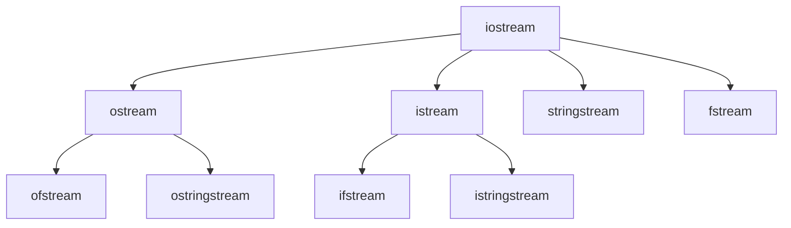

# 《C++ Primer第五版》笔记

视频链接：https://www.bilibili.com/video/BV1z64y1U7hs/?p=36&spm_id_from=333.880.my_history.page.click&vd_source=5ca8c9858efdf576a9c470964f99463a

## P7 类

### 7.1 定义抽象数据类型

1、类的基本思想是**数据抽象（接口与实现分离）和封装（把实现隐藏起来）**。

2、this是一个**指针常量**（包含类对象本身的地址），不允许改变指针里的地址。this的类型是(Sales_data* const)。

- 【底层const】常量指针：const int *PtrConst；// **指向常量的指针**

  底层const：指向的或者绑定的是const。不能通过解引用指针的方式，修改变量的值。称指针为常量的指针。

- 【顶层const】指针常量：int* const ConstPtr = &a；// 必须初始化，**指针本身是常量**

  顶层const：对象本身是const。指针在定义初始化之外，不能被赋值修改。称指针为指针常量。

3、定义一个返回this对象的函数

```C++
// 模拟复合运算符+=，为了和+=一致，返回为左值。
Sales_data& Sales_data::combine(const Sales_data &rhs) // right hand side
{
    units_sold += rhs.units_sold;
    revenue += rhs.revenue;
    return *this; // 返回调用该函数的对象
}
```

4、IO对象不能拷贝，只能引用。

5、拷贝、赋值和析构构造函数，如果没有定义，编译器将会提供合成的默认版本（default）。

**管理动态内存（new）的类，通常不能依赖于编译器合成的版本。（使用vector或string除外）**

---

### 7.2 友元

6、友元：允许其他类或函数（比如非类成员函数）访问自己的非公有成员。（友元不是类的一部分）

```C++
class Screen {
    // Window_mgmr的成员可以访问Screen类的私有部分
    friend class Window_mgmr;
    // 不对整个类开放，只对clear函数开放
    friend void Window_mgmr::clear(ScreenIndex);
}
```

令成员函数作为友元时，注意顺序：

- 定义Window_mgmt类，声明clear函数，**但不能定义它**；
- 定义Screen，包括对于clear的友元声明；
- 定义clear，此时才能使用Screen的成员。

---

### 7.3 类的其他特性

7、类的内部进行成员函数的定义，相当于隐式内敛（inline）。**也可以在类外进行定义，函数头加inline设为内联函数**。

8、可变数据成员：mutable。即使在一个const对象内也能被修改。

```c++
class Screen {
public:
    void some_member() const; // 对于const成员函数来说，this指针是const的，指向常量的指针。
private:
    mutable size_t access_ctr; // 即使在一个const对象内也能被修改
}

void Screen::some_member() const
{
    ++access_ctr;
}
```

9、类的前向申明

- 类的声明可以和定义分离，前向声明，在定义之前是一个不完整类型。（不能用于定义一个对象，因为需要知道对象占多大的空间）

- **不完整类型可以定义指向该类型的指针或引用，也可以作为函数声明中的参数或返回类型。**

```C++
class Screen; // 类的前向声明

class Link_screen {
    Screen window; // 错误，不完整类型
    Link_screen *next; // 正确，一旦类名字出现后，就被认为是声明过了
    Link_screen *prev;
}
```

---

### 7.4 类的作用域

10、类型名的定义应该放到类的开始处。

```C++
typedef double Money;
class Acount {
public:
    Money balance() { return bal; } // 使用外层作用域的Money
private:
    typedef double Money; // 错误，重复定义，编译器并不负责
    Money bal;
}
```

11、类的成员函数在实现定义时，用到的类/函数等，必须已经完成声明。

---

### 7.5 构造函数再探

12、如果成员是const、引用或者属于某种未提供默认构造函数的类类型，必须通过构造函数初始化列表提供初始值。

const和引用不属于赋值。

13、**构造函数初始值列表的顺序，不会影响实际的初始化顺序。**

```C++
class X {
    int i;
    int j;
    
public:
    X(int val) : j(val), i(j) {} // error, 按照定义顺序，i在j之前被初始化。
}
```

14、委托构造函数：把自己的一些（或全部）职责给了其他构造函数。

15、如果构造函数支持一个实参的调用，那么也就定义了从参数类型向类类型隐式转换的规则 （只允许一步类类型转换）-> explicit（抑制，一步也不允许隐式转换，explicit定义后只能用于直接初始化不能用于拷贝形式初始化）

16、聚合类：（可以使用初始值列表初始化，顺序要注意）

- 所有成员都是public
- 没有定义任何构造函数
- 没有类内初始值
- 没有基类，也没有virtual函数

17、字面值类（constexpr）

### 7.6 类的静态成员

18、static函数不包含this指针，所以不能定义成const函数。

19、静态成员不占用对象的内存。存在于任何对象之外，所有对象共享。

20、static关键字出现在类内部的声明语句中，外部定义不要static关键字。（内部声明，外部定义）

21、静态数据类型可以是不完全类型。（**static成员、指针都可以是不完全类型，对象必须是完全类型，需要知道分配多少空间**）

22、可以使用静态成员作为默认实参，因为它本身并不是对象的一部分。

## P8 C++标准库：IO类

### 8.1 IO类

23、IO库类型和头文件（w表示wchar_t）

| 头文件   | 类型                                                         |
| -------- | ------------------------------------------------------------ |
| iostream | istream, wistream 从流中读取；ostream, wostream 写到流中去；iostream, wiostream 对流进行读写 |
| fstream  | ifstream, wifstream 从文件中读取；ofstream, wofstream 写到文件中去；fstream, wfstream 读写文件 |
| sstream  | istringstream, wistringstream 从string对象中读取；ostringstream, wostringstream 写到string对象中去；                          stringstream, wstringstream 对string对象进行读写 |

24、IO对象不能拷贝或赋值。

25、IO库条件状态。

### 8.2 文件输入输出

26、每个流文件都有一个关联的**文件模式**（fille mode）

|             | 文件模式                                 |
| ----------- | ---------------------------------------- |
| in          | 以读方式打开                             |
| out         | 以写方式打开                             |
| app(append) | 追加：每次写操作前均定位到文件末尾       |
| ate(at end) | 每次打开文件后立即定位到末尾             |
| trunc       | 截断：如果打开的文件存在，其内容将被丢弃 |
| binary      | 以二进制方式进行IO                       |

### 8.3 string流

27、IO类继承关系



28、

```C++
sstream strm(s); // strm是一个sstream对象，保存string s的一个拷贝。此构造函数是explicit的。
strm.str(); // 返回strm所保存的string的拷贝。
strm.str(s); // 将string s拷贝到strm中。
```

29、string代表的是内存，istringstream是从内存读取数据，ostringstream是将数据写入内存。

