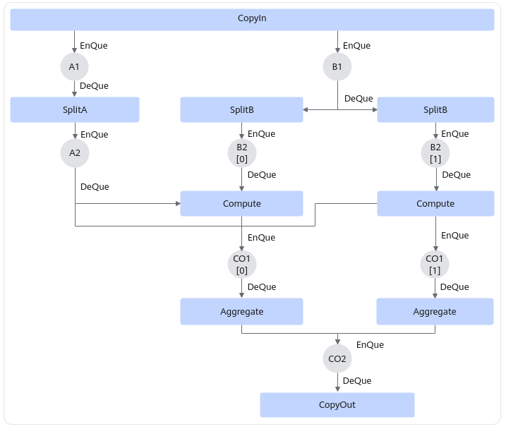
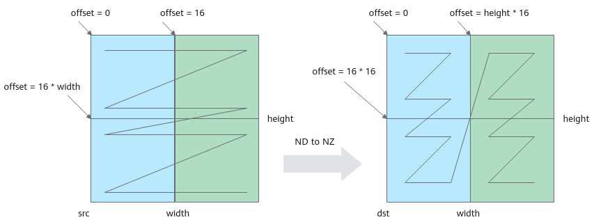
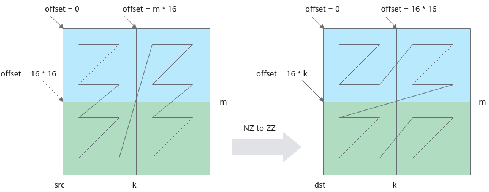
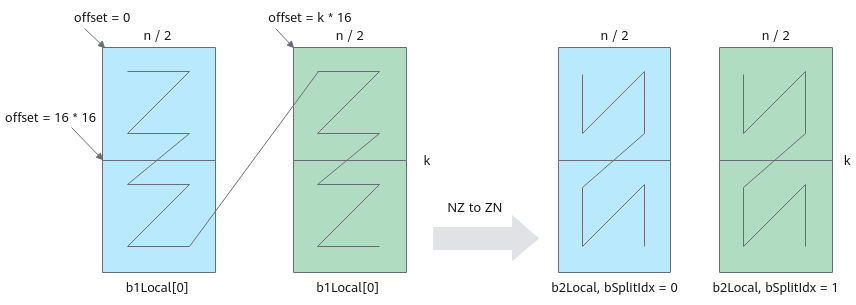
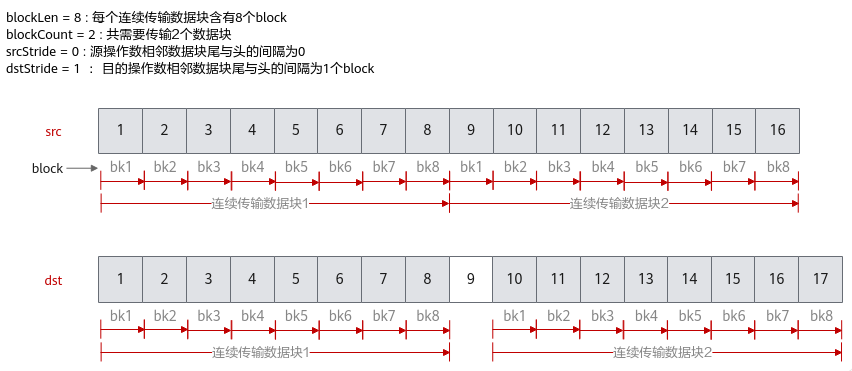
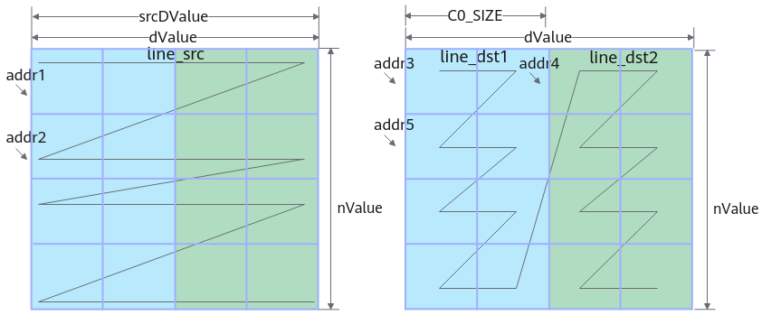
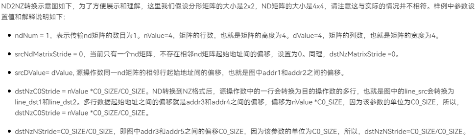
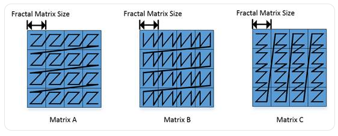

# Ascend C矩阵算子开发
## 一、矩阵编程相关内容
### 1. 矩阵算子流程
`CopyIn -> Split -> Compute -> Aggregate -> CopyOut`
### 2. 具体实现流程
- CopyIn  
搬运输入数据，`a, b从GM -> Local Memory A1, B1`；  
<mark>格式：ND格式 -> NZ格式（小z大N）</mark>
- Split  
（1）a矩阵从`A1->A2`<mark>，格式：NZ -> ZZ</mark>；  
（2）b矩阵切分成part1和part2, 形状为[k, n/2]，切分后再分块从`B1搬运至B2`<mark>，格式：NZ -> ZN（小N大Z）</mark>；  
- Compute  
a矩阵和b矩阵的part1、part2分别做矩阵乘运算，获得矩阵c的part1和part2，形状均为 [m, n/2]。计算结果存在CO1；
- Aggregate  
将矩阵c的part1和part2从CO1->CO2合并；
- CopyOut  
合并输出数据从CO2搬出，<mark>格式：NZ -> ND</mark>。


### 3. CopyIn实现
- 使用`DataCopy`接口将矩阵a,b搬运到Local Memory，且将数据格式从`ND->NZ`。

```
第一次循环搬运蓝色部分，第二次循环搬运绿色部分？

一次DataCopy指令搬运height * 16个数，循环执行width / 16次。DataCopy参数设置如下：
（1）blockCount：设置为height，共搬运height次；？
（2）blockLen：设置为1，一次搬运16个half类型的数；？
（3）srcStride：设置为width/16 - 1，源矩阵每搬运一个block需要跳跃一行；√
（4）dstStride：设置为0，目的矩阵每个block在内存中连续存储；
（5）每次循环迭代，源矩阵首地址移动16个数，目的矩阵首地址移动16 * height个数；
```

### 4. SplitA实现
- 整体流程：DeQue从A1中的Queue取出a1Local -> AllocaTensor从A2的Queue申请a2Local -> <mark>LoadData将a搬运到A2，格式从Nz->Zz</mark> -> EnQue将a2Local放入A2的Queue；

- 使用`LoadData将矩阵a从A1->A2`，格式从`Nz->Zz`

    ```
    （1）图示k=32, 占kBlocks=k/16=2个分形；图示m=32，占mBlocks=m/16=2个分形；一共搬运4个。
    （2）调用一次LoadData完成两个16*16分行的搬运；循环搬运两次；
    （3）第一次循环搬运蓝色部分两个分形，第二次循环搬运绿色部分两个分形；
    ```

- 单次循环LoadData的参数设置：  
  - `repeatTimes`：数据处理的迭代次数，LoadData每个迭代处理一个分形，该参数表示待搬运分形的个数，即k轴方向分形个数：`kBlocks=k/16`；
  - `srcStride`：相邻迭代间源操作数分形首地址之间的间隔，如第一个蓝色分形和第二个蓝色分形起始地址之间的间隔：`mBlocks=m/16`(个分形)；  
  - `dstStride`：使用默认值，`目的矩阵两个分形连续存储`；
  - `ifTranspose`：设置为false，搬运前后都为Z格式，不使能转置；
  - 每次迭代，`源矩阵首地址偏移：16 * 16`；(第一行与第二行：`offset=16*16`)
  - 每次迭代，`目的矩阵首地址偏移：16 * k`；(第一行与第二行：`offset=16*k`)

### 5. SplitB实现
- 整体流程：DeQue从B1的Queue中取出b1Local和循环迭代变量index -> AllocTensor从B2的Queue中申请b2Local -> <mark>LoadData将b矩阵搬运到B2，格式从Nz->Zn</mark> -> EnQue将b2Local放入B2的Queue；

- 使用`LoadData将b矩阵从B1->B2，格式从Nz->Zn`

    ```
    （1）图示k=32, 占kBlocks=k/16=2个分形；图示n=32，占nBlocks=n/16=2个分形；一共搬运4个。
    （2）调用一次LoadData完成两个16*16分行的搬运；循环搬运两次；
    （3）第一次搬运蓝色部分的两个分形，第二次循环搬运绿色部分的两个分形；
    ```

- 单次循环LoadData的参数设置：  
  - `repeatTimes`：数据处理的迭代次数，LoadData每个迭代处理一个分形，该参数表示待搬运分形的个数，即k轴方向分形个数：`kBlocks=k/16`；
  - `srcStride`：相邻迭代间源操作数分形首地址之间的间隔，如第一个蓝色分形和第二个蓝色分形起始地址之间的间隔：`1`(个分形)，两个分形连续存储；  
  - `dstStride`：使用默认值，`目的矩阵两个分形连续存储`；
  - `ifTranspose`：<mark>设置为true，每块分形搬运前为Z格式，搬运后需要为N格式，需要使能转置</mark>；
  - 每次迭代，`源矩阵首地址偏移：bSize / 2`；

## 二、相关接口API
### 1. 数据搬移接口 — DataCopy
实现外部存储和内部存储间的数据搬运

#### 1.1 功能说明
- 支持的数据传输通路
    ```
    GM->A1
    GM->B1
    CO1->CO2
    CO2->GM
    GM->VECIN
    VECIN->VECOUT
    VECOUT->GM
    ```
#### 1.2 定义原型
- 普通数据搬运0级接口
- 普通数据搬运2级接口
- 增强数据搬运0级接口（相比普通数据增加了随路计算）
- 切片数据搬运
- 随路转换数据搬运（适用于cube数据搬运）
  - 通路：GM->A1; GM->B1 (ND2NZ)
  - 通路：VECOUT->GM (NZ2ND)

#### 1.3 参数说明
- DataCopyParams参数类型（普通数据搬运）
    ```
    blockCount: 包含的连续传输数据块个数;
    blockLen: 每个连续传输数据块长度，单位为data block(32Bytes)；
    srcStride: 源操作数，相邻连续数据块的间隔（前面一个数据块的尾与后面数据块的头的间隔）；
    dstStride: 目的操作数，相邻连续数据块间的间隔。
    ```
    

- DataCopyEnhancedParams参数类型（增强数据搬运）
   ```
   blockMode：数据搬移基本分形配置；BLOCK_MODE_NORMAL/BLOCK_MODE_MATRIX等
   deqScale：随路精度转换辅助参数，即量化模式
   deqValue：随路精度转换大小
   sidStoreMode：用于配置存储模式或sid
   isRelu：仅用于CO1->CO2通路，配置是否可以随路做线性整流操作
   padMode：仅用于GM->A1/GM->B1通路，用于随路加pad补齐
   ```

- Nd2NzParams参数类型（ND2NZ随路格式转换）
    
    
    ```
    nd2nz只支持GM -> A1或B1

    # 参数说明
    ndNum: 传输nd矩阵的数目
    nValue: nd矩阵的行数
    dValue: nd矩阵的列数
    srcNDMatrixStride：源操作数相邻nd矩阵起始地址间的偏移
    srcDValue: 源操作数同一nd矩阵的相邻行起始地址间的偏移
    dstNzC0Stride: ND转换到NZ格式后，【源操作数中的一行会转换为目的操作数的多行】。dstNzC0Stride表示，目的nz矩阵中，来自源操作数同一行的多行数据相邻行起始地址间的偏移
    dstNZNStride: 目的nz矩阵中，Z型矩阵相邻行起始地址之间的偏移
    dstNzMatrixStride: 目的nz矩阵中，相邻nz矩阵起始地址间的偏移
    ``` 

#### 1.4 注意事项
- 增强搬运主要分为CO1->CO2及其他情况两种；
- 随路格式转换nd2nz只支持GM->A1,GM->B1； nz2nd只支持VECOUT->GM；

### 2. 矩阵数据格式转换 — LoadData
#### 2.1 功能说明
LoadData分为Load2D和load3D  
（1）Load2D
  - 源操作数/目的操作数的数据类型为uint8_t/int8_t时，<mark>分形矩阵大小在A1/A2上为16 * 32， 在B1/B2上为32 * 16</mark>。  
  - 源操作数/目的操作数的数据类型为uint16_t/int16_t/half时，分形矩阵在A1/B1/A2/B2上的大小为16*16。  
  - 支持如下数据通路：GM->A1; GM->B1; GM->A2; GM->B2; <mark>A1->A2; B1->B2</mark>。
（2）Load3D
  - image to column操作，将多维feature map转为二维矩阵
  - 支持如下数据通路：A1->A2；B1->B2

#### 2.2 定义原型

#### 2.3 Load2D参数说明
- 通用参数说明
  ```
  dstLocal：目的操作数，类型为LocalTensor；A2(Zz格式)；B2(Zn格式)；A1/B1：无格式要求，一般为Nz格式；
  srcLocal：源操作数，类型为LocalTensor或GlobalTensor
  loadDataParams：LoadData参数结构体
  ```

- LoadData2dParams
  - `startIndex`：分行矩阵ID，说明搬运起始位置为源操作数中第几个分形，单位：512B
  - `repeatTimes`：迭代次数（每次迭代可处理512B数据，如int8 32*16*1B=512B）
  - `srcStride`：相邻迭代间，源操作数前一个分形与后一个分形起始地址的间隔
  - sid：预留参数，配置为0
  - `dstGap`：相邻迭代间，目的操作数前一个分形结束地址与后一个分形起始地址的间隔；
  - `ifTranspose`：是否启用转置功能，true启用，false不启用；
  - `addrMode`：预留参数，配置为0。

- LoadData3DParamsV1
- LoadData3DParamsV2

### 3. 矩阵计算接口 — Mmad
#### 数据格式说明
`Mmad` 函数对于输入数据的格式要求和输出数据的要求如下图，`矩阵 ABC 分别为 A2/B2/CO1 中的数据`。下图中每个小方格代表一个 512Byte 的分形矩阵（`对于 b8 来说是 16x32，对于 b16/b32 来说则是 16x16`）。下图中Z字形的黑色线条代表对应位置数据在昇腾AI处理器上的排列顺序，起始点是左上角，终点是右下角  
A：Zz，大Z小z；
B：Zn，大Z小n；
C：Nz，大N小z；



### 4. 管理Tensor数据结构Queue队列的接口 — EnQue,Deque

## 三、相关背景知识
- TBE算子和Ascend C算子

## 参考链接
https://www.hiascend.com/document/detail/zh/canncommercial/70RC1/operatordev/Ascendcopdevg/atlas_ascendc_10_0051.html