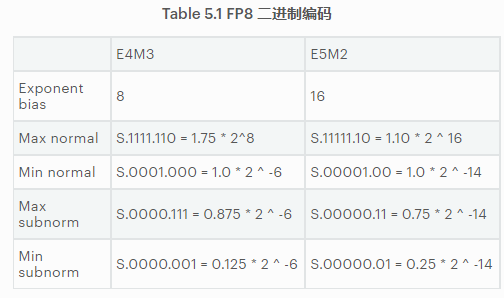
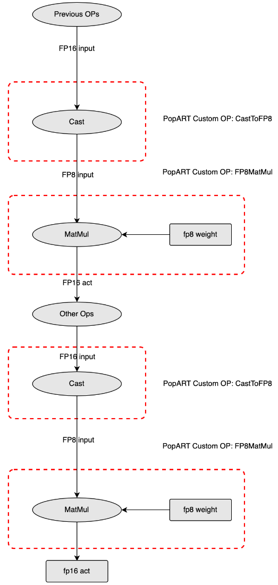

# [PORPT使用FP8数据类型](https://graphcore.github.io/PopRT/1.0.2/features/using_fp8.html)  

## IPU FP8类型介绍
- FP8 顾名思义即 8bit 的 float 数据类型, 内存占用为 FP32 的 1/4, FP16 的 1/2, 与 INT8 一样
- 与 FP32/FP16 相比, FP8 的动态范围要小得多, 为了扩大表达范围, FP8 还支持通过一个额外的 scale 参数来调整表示范围, scale 越大, 表示范围越大, 精度越低, scale 越小, 表示范围越小, 精度越高。IPU 支持两种 FP8 数据类型: F8E4M3 和 F8E5M2。

## FP8量化介绍
- 模型量化在实际应用中很常见, 其中 INT8 量化更是被广泛应用, <mark>这是将模型中所有的输入和参数转换为 INT8 格式同时只损失很少精度的技术, 可以在降低内存占用的情况下加快推理速度</mark>, 主要包括`后训练量化和量化训练`这两种, <mark>量化对象为权重和输入</mark>, 它们都会引入额外的数据还原层, 会增加计算量, 不像 FP32 转 FP16 那样直接。

- FP8 量化的目的也是最大限度将低精度转换后的损失, 转换过程跟 FP32 转 FP16 一样直接。
- FP8 量化会确定一组 scale 和 format 参数, 满足精度损失尽可能低的要求。

- 关于`权重量化`, IPU 支持的 FP8 算子暂时只包括 Conv/MatMul/Cast, 所以会把 FP16/FP32 模型对应算子的权重取出并做 FP8 转换, <mark>转换时会为每一组权重设置不同的 scale 和 format 参数, 然后将转换后的权重与 FP16/FP32 的权重计算损失, 损失最小的那组对应的 scale 和 format 就为该层权重最佳的 FP8 参数</mark>, 之后按同样的方式处理下一组权重. 整个转换过程在 CPU 上进行, 损失包括 `mse/mae/snr/kld/cos_dist`, 量化时指定其中一种即可

- 关于`输入量化`, 量化原理与权重量化一致, 处理方式有些许区别. 由于每个 FP8 算子的输入是未知的, 无法直接对输入做量化, <mark>所以需要事先给定一些校验数据进行推理, 然后记录每个 FP8 算子的输入, 接着要做的事情就是和权重量化一样, 通过遍历的方法找到 FP16/FP32 的输入与 FP8 输入损失最小的那组 scale 和 format</mark>

##  FP32 模型转 FP8 模型的流程
- 对于 MatMul 和 Conv 等计算密度高的算子, FP8 类型比 FP16 类型`有更高的算力`, 因此把模型从 FP32/FP16 转换成 FP8, <mark>能够提高模型的吞吐, 降低模型的延时</mark>. 另外由于 IPU 是把整个模型放到片上运行, FP8 类型的 Tensor 相比 FP32/FP16 类型的 Tensor, `需要的存储空间更小`, <mark>因此 IPU 能够跑更大规模的模型, 或者支持更大的 Batch Size</mark>

## FP8模型转换工具使用方法
- 使用方式1：用默认的 `scale` 和 `format` 进行快速转换, 值分别为 0 和 F143, 这样可以很快的验证模型是否能成功转换为 `FP8`, 更加方便的验证 `FP8` 模型的速度。
- 使用方式2：启用 `FP8` 的量化工具进行转换, 这种方式会消耗一些时间来计算最佳的 `scale` 和 `format`, 可以让模型的精度损失更低, 还能得到不同参数下各层的误差情况, 方便进行精度的进一步调试。
