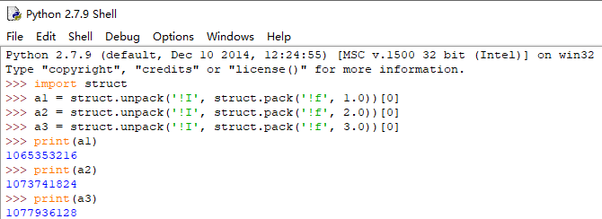

# 一、Python小数转ieee浮点数
## 1. IEEE浮点数
- 定义  
  > IEEE浮点数是由IEEE制定的一种标准的浮点数表示方法。它将一个实数分解为`符号位、指数位和尾数位`，以科学计数法的形式表示。IEEE浮点数的范围和精度与计算机的体系结构和浮点数的大小有关。在Python中，浮点数默认采用`IEEE 754`标准表示。

- IEEE浮点数表示方法  
  > IEEE浮点数采用二进制形式表示实数。由三个部分组成：  
  （1）符号位(Sign Bit)：用于表示正数的正负。0表示正数，1表示负数。  
  （2）指数位（Exponent）：用于表示数的数量级。指数位通过偏移来表示，所以可以表示正数和负数的指数。  
  （3）尾数位（Mantissa）：用于表示数的精度。尾数位是一个小数，通常是一个小于1的小数。  
  IEEE浮点数可以采用单精度(32位)或双精度(64位)进行表示。


## 2. 示例
```python
// python实现方法
import struct

# （1）struct.pack('!f', f)将小数f转换为32位的二进制表示形式
# （2）然后struct.unpack('!I',...)将二进制表示形式转换回整数
# （3）最后使用[0]来获取整数值
# 若要将小数转换为双精度IEEE浮点数，可以使用'!d'代替'!f'
def float_to_ieee32(f):
    return struct.unpack('!I', struct.pack('!f', f))[0]

# test
print(float_to_ieee32(3.14))

// TODO cpp实现方法
```


## 参考链接
[1] [python小数转ieee浮点数](https://blog.51cto.com/u_16175446/6892869)  
[2] [例子_float32类型的二进制值转换为十进制](https://blog.csdn.net/qq_36134287/article/details/132024748)  
[3] [32 位 float 型的二进制存储 ](https://www.runoob.com/w3cnote/32-float-storage.html)